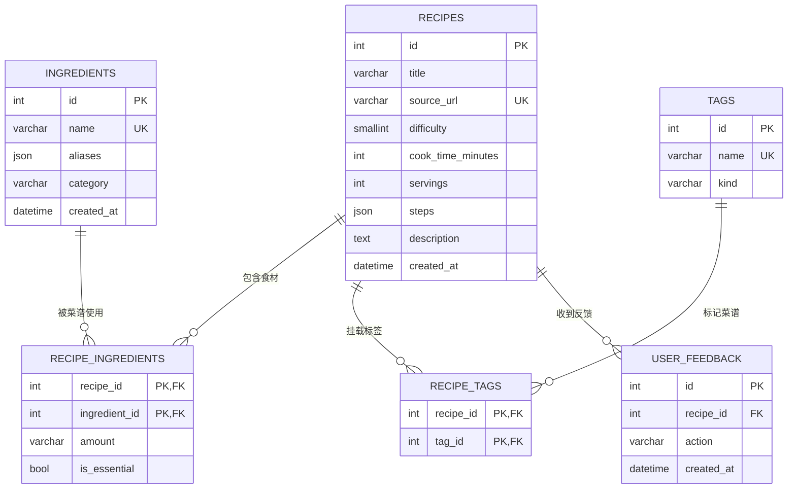

# 数据库设计文档（MySQL）

> 库名：`ai_cooker`（测试库：`ai_cooker_test`）· 引擎：InnoDB · 字符集：`utf8mb4` / 排序规则：`utf8mb4_unicode_ci` · MySQL 8.x（本机验证 8.0.29，Docker 镜像 8.4）

**事实源与同步**：表结构以 [app/models/](../app/models/) 模型 + Alembic 迁移（[migrations/](../migrations/)）为唯一事实源，禁止手工改库；本文档与 2026-08-28 实际库结构同步。结构变更流程：改模型 → `alembic revision --autogenerate` → 审查迁移 → `alembic upgrade head` → 同步本文档。

## 1. 表总览

| 表名 | 用途 | 关键约束 | 当前数据 |
|---|---|---|---|
| `recipes` | 菜谱主表 | `source_url` 唯一（采集幂等） | 0 |
| `ingredients` | 食材词典（标准名 + 别名） | `name` 唯一 | 32 |
| `recipe_ingredients` | 菜谱 ↔ 食材（多对多） | 联合主键 + 级联删除 | 0 |
| `tags` | 标签词典（过敏原/忌口/菜系/口味） | `name` 唯一 | 5 |
| `recipe_tags` | 菜谱 ↔ 标签（多对多） | 联合主键 + 级联删除 | 0 |
| `user_feedback` | 用户反馈（收藏 / 不喜欢） | `recipe_id` 可空，删除置 NULL | 0 |

## 2. 关系图（ER）



## 3. 表结构明细

### 3.1 `recipes` —— 菜谱主表

| 字段 | 类型 | 必填 | 默认 | 说明 |
|---|---|---|---|---|
| `id` | INT | 是 | AUTO_INCREMENT | 主键 |
| `title` | VARCHAR(255) | 是 | — | 菜谱标题 |
| `source_url` | VARCHAR(500) | 是 | — | 来源 URL，**唯一索引**（采集去重 / 幂等依据） |
| `difficulty` | SMALLINT | 否 | NULL | 难度 1-3：简单 / 中等 / 复杂 |
| `cook_time_minutes` | INT | 否 | NULL | 烹饪时长（分钟） |
| `servings` | INT | 否 | NULL | 份数 |
| `steps` | JSON | 否 | NULL | 做法步骤数组，P1 采集时约定结构（如 `[{instruction, minutes}]`） |
| `description` | TEXT | 否 | NULL | 简介 / 描述 |
| `created_at` | DATETIME | 是 | `now()` | 创建时间 |

索引：`PRIMARY KEY (id)`、`UNIQUE KEY (source_url)`。

### 3.2 `ingredients` —— 食材词典

| 字段 | 类型 | 必填 | 默认 | 说明 |
|---|---|---|---|---|
| `id` | INT | 是 | AUTO_INCREMENT | 主键 |
| `name` | VARCHAR(100) | 是 | — | 标准名，**唯一**（如“土豆”） |
| `aliases` | JSON | 否 | NULL | 别名数组（如 `["马铃薯","洋芋"]`），供四级映射与搜索 |
| `category` | VARCHAR(50) | 否 | NULL | 分类（蔬菜 / 肉类 / 海鲜 / 调料…） |
| `created_at` | DATETIME | 是 | `now()` | 创建时间 |

索引：`PRIMARY KEY (id)`、`UNIQUE KEY (name)`。

> 备注：`aliases LIKE` 检索依赖 MySQL 对 JSON 列的隐式转换，仅适合词典小数据量；P2 起由向量检索替代（见 [PLAN.md](PLAN.md) 8.8）。

### 3.3 `recipe_ingredients` —— 菜谱 ↔ 食材关联

| 字段 | 类型 | 必填 | 默认 | 说明 |
|---|---|---|---|---|
| `recipe_id` | INT | 是 | — | 菜谱 ID，联合主键 + FK（删除级联） |
| `ingredient_id` | INT | 是 | — | 食材 ID，联合主键 + FK（删除级联） |
| `amount` | VARCHAR(100) | 否 | NULL | 用量描述（如“2 个”“300g”） |
| `is_essential` | TINYINT(1) | 是 | 1 | 是否必需（缺料提示 / 替代建议依据） |

约束：`PRIMARY KEY (recipe_id, ingredient_id)`、`UNIQUE (recipe_id, ingredient_id)`、二级索引 `(ingredient_id)`。

### 3.4 `tags` —— 标签词典

| 字段 | 类型 | 必填 | 默认 | 说明 |
|---|---|---|---|---|
| `id` | INT | 是 | AUTO_INCREMENT | 主键 |
| `name` | VARCHAR(50) | 是 | — | 标签名，**唯一**（如“海鲜”“辣”“素食”） |
| `kind` | VARCHAR(20) | 是 | — | 分类：`过敏原` / `忌口` / `菜系` / `口味` |

索引：`PRIMARY KEY (id)`、`UNIQUE KEY (name)`。

### 3.5 `recipe_tags` —— 菜谱 ↔ 标签关联

| 字段 | 类型 | 必填 | 默认 | 说明 |
|---|---|---|---|---|
| `recipe_id` | INT | 是 | — | 菜谱 ID，联合主键 + FK（删除级联） |
| `tag_id` | INT | 是 | — | 标签 ID，联合主键 + FK（删除级联） |

约束：`PRIMARY KEY (recipe_id, tag_id)`、`UNIQUE (recipe_id, tag_id)`、二级索引 `(tag_id)`。

### 3.6 `user_feedback` —— 用户反馈

| 字段 | 类型 | 必填 | 默认 | 说明 |
|---|---|---|---|---|
| `id` | INT | 是 | AUTO_INCREMENT | 主键 |
| `recipe_id` | INT | 否 | NULL | 菜谱 ID，FK（菜谱删除时置 NULL）；匿名化后可为 NULL |
| `action` | VARCHAR(20) | 是 | — | 行为：`like` / `dislike` |
| `created_at` | DATETIME | 是 | `now()` | 创建时间 |

索引：`PRIMARY KEY (id)`、二级索引 `(recipe_id)`。

## 4. 约束与删除策略汇总

| 约束 | 涉及表 | 说明 |
|---|---|---|
| `source_url` 唯一 | `recipes` | 采集去重 / 幂等入库 |
| `ingredients.name` 唯一 | `ingredients` | 词典标准名唯一 |
| `tags.name` 唯一 | `tags` | 标签唯一 |
| 联合主键 | `recipe_ingredients` / `recipe_tags` | 防止重复关联 |
| FK 级联删除 | `recipe_ingredients` / `recipe_tags` | 删菜谱自动清理关联 |
| FK 置 NULL | `user_feedback.recipe_id` | 菜谱删除后保留反馈记录 |

## 5. 各模块对表的读写关系

| 表 | 读取方 | 写入方 |
|---|---|---|
| `recipes` | `GET /api/recipes/{id}`（P0）；`retrieve` / `rank`（P2） | `RecipeCrawler.save()`（P1） |
| `ingredients` | `GET /api/ingredients/search`（P0）；`link` 节点四级映射（P3） | 种子脚本（P0）；采集新增食材（P1）；词库审核扩充 |
| `recipe_ingredients` | `retrieve` / `rank` 缺料计算（P2） | `RecipeCrawler.save()`（P1） |
| `tags` | `GET /api/tags`（P0）；`filter` 忌口过滤（P3） | 种子脚本（P0）；采集新增标签（P1） |
| `recipe_tags` | `filter` / `rank`（P3） | `RecipeCrawler.save()`（P1） |
| `user_feedback` | LangSmith 评测数据导出（P5） | 反馈 API（P5 前后端联调） |

## 6. 变更流程与注意事项

1. 改模型（`app/models/`）→ `uv run alembic revision --autogenerate -m "说明"` → 人工审查生成的迁移 → `uv run alembic upgrade head`。
2. 同步更新本文档与 [PLAN.md](PLAN.md) 5.2 的字段约定。
3. 生产 / 测试库禁止手写 DDL；`ai_cooker_test` 由 `tests/conftest.py` 自动迁移，新环境需先用 root 预建库并授权（见 [README.md](../README.md) 方式 B）。
4. 所有查询走参数化（SQLAlchemy 表达式 / `text` 绑定参数），防止 SQL 注入。

## 7. P1 约定（已实施，2026-08-29）

以下约定已在 P1 实施并生效（数据库结构本身未新增表）：

- `recipes.steps` JSON 结构约定为 `[{"instruction": str, "minutes": int|null}]`。
- 采集 JSON 中间产物（schema_version=1）区分 `ingredients`（食材）与 `seasonings`（调料）；两者入库统一经 `recipe_ingredients` 关联，调料写入 `ingredients` 表时 `category='调料'`。
- P2 评分时调料不参与“缺料”惩罚，仅作信息展示与降权依据。

## 附录：当前 DDL（2026-08-28 实际库导出）

```sql
CREATE TABLE `recipes` (
  `id` int NOT NULL AUTO_INCREMENT,
  `title` varchar(255) COLLATE utf8mb4_unicode_ci NOT NULL,
  `source_url` varchar(500) COLLATE utf8mb4_unicode_ci NOT NULL,
  `difficulty` smallint DEFAULT NULL COMMENT '1-3：简单/中等/复杂',
  `cook_time_minutes` int DEFAULT NULL,
  `servings` int DEFAULT NULL,
  `steps` json DEFAULT NULL,
  `description` text COLLATE utf8mb4_unicode_ci,
  `created_at` datetime NOT NULL DEFAULT (now()),
  PRIMARY KEY (`id`),
  UNIQUE KEY `source_url` (`source_url`)
) ENGINE=InnoDB DEFAULT CHARSET=utf8mb4 COLLATE=utf8mb4_unicode_ci;

CREATE TABLE `ingredients` (
  `id` int NOT NULL AUTO_INCREMENT,
  `name` varchar(100) COLLATE utf8mb4_unicode_ci NOT NULL,
  `aliases` json DEFAULT NULL,
  `category` varchar(50) COLLATE utf8mb4_unicode_ci DEFAULT NULL,
  `created_at` datetime NOT NULL DEFAULT (now()),
  PRIMARY KEY (`id`),
  UNIQUE KEY `name` (`name`)
) ENGINE=InnoDB DEFAULT CHARSET=utf8mb4 COLLATE=utf8mb4_unicode_ci;

CREATE TABLE `recipe_ingredients` (
  `recipe_id` int NOT NULL,
  `ingredient_id` int NOT NULL,
  `amount` varchar(100) COLLATE utf8mb4_unicode_ci DEFAULT NULL,
  `is_essential` tinyint(1) NOT NULL,
  PRIMARY KEY (`recipe_id`,`ingredient_id`),
  UNIQUE KEY `uq_recipe_ingredient` (`recipe_id`,`ingredient_id`),
  KEY `ingredient_id` (`ingredient_id`),
  CONSTRAINT `recipe_ingredients_ibfk_1` FOREIGN KEY (`ingredient_id`) REFERENCES `ingredients` (`id`) ON DELETE CASCADE,
  CONSTRAINT `recipe_ingredients_ibfk_2` FOREIGN KEY (`recipe_id`) REFERENCES `recipes` (`id`) ON DELETE CASCADE
) ENGINE=InnoDB DEFAULT CHARSET=utf8mb4 COLLATE=utf8mb4_unicode_ci;

CREATE TABLE `tags` (
  `id` int NOT NULL AUTO_INCREMENT,
  `name` varchar(50) COLLATE utf8mb4_unicode_ci NOT NULL,
  `kind` varchar(20) COLLATE utf8mb4_unicode_ci NOT NULL,
  PRIMARY KEY (`id`),
  UNIQUE KEY `name` (`name`)
) ENGINE=InnoDB DEFAULT CHARSET=utf8mb4 COLLATE=utf8mb4_unicode_ci;

CREATE TABLE `recipe_tags` (
  `recipe_id` int NOT NULL,
  `tag_id` int NOT NULL,
  PRIMARY KEY (`recipe_id`,`tag_id`),
  UNIQUE KEY `uq_recipe_tag` (`recipe_id`,`tag_id`),
  KEY `tag_id` (`tag_id`),
  CONSTRAINT `recipe_tags_ibfk_1` FOREIGN KEY (`recipe_id`) REFERENCES `recipes` (`id`) ON DELETE CASCADE,
  CONSTRAINT `recipe_tags_ibfk_2` FOREIGN KEY (`tag_id`) REFERENCES `tags` (`id`) ON DELETE CASCADE
) ENGINE=InnoDB DEFAULT CHARSET=utf8mb4 COLLATE=utf8mb4_unicode_ci;

CREATE TABLE `user_feedback` (
  `id` int NOT NULL AUTO_INCREMENT,
  `recipe_id` int DEFAULT NULL,
  `action` varchar(20) COLLATE utf8mb4_unicode_ci NOT NULL,
  `created_at` datetime NOT NULL DEFAULT (now()),
  PRIMARY KEY (`id`),
  KEY `recipe_id` (`recipe_id`),
  CONSTRAINT `user_feedback_ibfk_1` FOREIGN KEY (`recipe_id`) REFERENCES `recipes` (`id`) ON DELETE SET NULL
) ENGINE=InnoDB DEFAULT CHARSET=utf8mb4 COLLATE=utf8mb4_unicode_ci;
```
