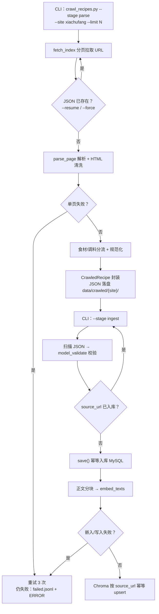

# P1 采集管线 —— 实施计划（修订版：JSON 中间产物，食材/调料分流）

> 阶段状态：**P1 已完成（parse + ingest，2026-08-29 验收通过；P0 于 2026-08-28 验收）**。本文档依据 [docs/PLAN.md](PLAN.md) 第 3.2、4、7 节与 [docs/DB.md](DB.md) 编写；parse 阶段（采集/解析/清洗/分流/JSON 落盘/断点续采/CLI）与 ingest 阶段（MySQL 入库 + Chroma 向量化）均已实施，验收结果见本文档第 11 节。

## 1. 目标与范围

### 1.1 目标

P1 交付**两阶段菜谱采集管线**：采集阶段把每个菜谱解析并封装为 JSON 文件落盘，入库阶段读取 JSON 文件写入 MySQL 与 Chroma。JSON 格式明确区分**食材（ingredients）、调料（seasonings）、标签（tags）、步骤（steps）**等字段，调料作为独立字段保存并在入库时标记 `category='调料'`，为后续检索评分区分“缺食材”与“缺调料”提供依据。

### 1.2 范围外（留给后续阶段）

- 检索、评分、推荐生成（P2/P3）；
- LLM 食材识别与四级词典映射（P3）；
- 全量性能压测、API 限流、LangSmith 评测（P5）；
- 多站点采集：P1 只做一个适配器，注册表与基类已支持后续扩展。

## 2. 前置条件（P0 现状与本阶段承接项）

P0 已交付：FastAPI 骨架、6 张 MySQL 表（Alembic 迁移幂等）、`RecipeCrawler` 基类（`CrawledRecipe` / `save()` 按 `source_url` 幂等）、`EmbeddingProvider` 接口、采集器注册表、兜底框架（`retry_with_backoff` / `DegradedResult` / `FallbackError`）、19 个测试全绿。

**P1 承接 P0 复盘（PLAN.md 8.8）中的待办**：

| 待办 | P1 处置 |
|---|---|
| `/health` 拆 liveness / readiness | 拆为 `/health/live`（恒 200）与 `/health/ready`（DB + Chroma 连通，故障 503） |
| 日志 / 告警缺失 | 新增 `app/core/logging.py` 结构化日志；采集错误按事件落 ERROR 级日志 |
| `scripts/init_test_db.sql` 缺失 | 补充该脚本，新环境一条命令预建测试库 |
| `recipes.steps` JSON 结构未约定 | 约定 `[{instruction, minutes}]` 并同步 DB.md |
| 依赖缺口（httpx / bs4 / chromadb） | 实施时加入（见 4.4） |

## 3. 两阶段管线与 JSON 格式

### 3.1 阶段一：采集（parse）

`fetch_index` 分页拉取 URL → 逐页 `parse_page` 解析 + HTML 清洗 → **食材/调料分流** → 规范化（量词剥离、别名映射、steps 结构）→ 封装 `CrawledRecipe` → JSON 落盘 `data/crawled/{site}/{sha256(source_url)}.json`。

### 3.2 阶段二：入库（ingest）

扫描 `data/crawled/{site}/*.json` → `CrawledRecipe.model_validate()` 严格校验 → `save()` 幂等入库 MySQL → 结构语义分块（`text_builder.py`：标题/用料/步骤不混块、贪心合并至 500 字、无 overlap）→ `embed_texts` → 先删旧块再 Chroma upsert（防孤儿块）。

### 3.3 JSON 文件格式（schema_version = 1）

```json
{
  "schema_version": 1,
  "site": "xiachufang",
  "crawled_at": "2026-08-28T21:00:00+08:00",
  "recipe": {
    "title": "土豆炒鸡蛋",
    "source_url": "https://www.xiachufang.com/recipe/100000000/",
    "difficulty": 1,
    "cook_time_minutes": 20,
    "servings": 2,
    "description": "简单家常菜",
    "ingredients": [
      {"name": "土豆", "amount": "2个", "is_essential": true},
      {"name": "鸡蛋", "amount": "3个", "is_essential": true}
    ],
    "seasonings": [
      {"name": "盐", "amount": "适量", "is_essential": false},
      {"name": "食用油", "amount": "少许", "is_essential": false}
    ],
    "tags": ["家常菜"],
    "steps": [
      {"instruction": "土豆切片", "minutes": 5},
      {"instruction": "热油下蛋翻炒", "minutes": 8}
    ]
  }
}
```

### 3.4 字段语义

- `ingredients`：主料 / 食材（用户“有没有”决定推荐可行性的部分）。
- `seasonings`：调料（盐、酱油、油、糖、料酒、醋、鸡精等厨房常备，不计入“缺料”惩罚）。
- `tags`：菜系 / 口味 / 忌口标签。
- `steps`：`[{instruction, minutes}]` 结构约定。

## 4. 关键变更（接口 / 文件 / 配置）

### 4.1 接口变更

- `app/core/crawler.py`（M）：`CrawledRecipe` 新增 `seasonings: list[CrawledIngredient] = []`（默认空表，向后兼容）；`save()` 对 seasonings 与 ingredients 统一建 `recipe_ingredients` 关联，调料写 `ingredients` 表时 `category='调料'`。
- `EmbeddingProvider.embed_texts` 接口不变，新增实现 `OpenAICompatibleEmbeddings`。
- `LLMProvider.structured(prompt, schema)` 新增实现 `OpenAICompatibleLLM`（httpx 直调 `/chat/completions`、JSON 提取 + pydantic 强校验；配置 `LLM_BASE_URL` / `LLM_MODEL` / `LLM_API_KEY`，P3 消费）。

### 4.2 新增文件

```
app/ingestion/json_store.py          # JSON 文件读写、判重、失败清单、invalid/ 转移
app/ingestion/text_builder.py        # 菜谱 → 分块文本
app/ingestion/pipeline.py            # 两阶段编排：parse 落盘 / ingest 入库
app/crawlers/xiachufang.py           # 下厨房适配器（首个 Crawler）
app/core/seasoning_words.py          # 调料词表 + 判定函数
app/core/openai_embeddings.py        # OpenAICompatibleEmbeddings
app/core/openai_llm.py               # OpenAICompatibleLLM（P3 消费）
app/vector_store.py                  # ChromaStore（collection recipe_docs）
app/core/logging.py                  # 结构化日志
scripts/crawl_recipes.py             # CLI：--site / --stage parse|ingest / --limit / --dry-run / --force
scripts/init_test_db.sql             # 测试库预建 SQL
tests/fixtures/xiachufang_index.html # 索引页样例
tests/fixtures/xiachufang_recipe.html# 菜谱详情页样例
```

### 4.3 配置新增（`app/config.py` / `.env.example`）

```text
# 向量化 / LLM（模型与服务商切换；密钥仅环境变量）
CHROMA_DIR=./data/chroma
CHROMA_COLLECTION=recipe_docs
EMBEDDING_BASE_URL=https://api.openai.com/v1
EMBEDDING_MODEL=text-embedding-3-small
EMBEDDING_API_KEY=
EMBEDDING_BATCH_SIZE=64
LLM_BASE_URL=https://api.openai.com/v1
LLM_MODEL=gpt-4o-mini
LLM_API_KEY=
```

> 采集 / 日志参数（delay=10.0 对齐 robots、timeout、retry、UA、域名白名单 www+m、`LOG_LEVEL`）默认在 `app/config.py`；`.env` 实际仅保留 `DATABASE_URL` 与嵌入/LLM 的 base_url/model/key，其余取代码默认值，完整模板见 `.env.example`。

`.gitignore` 追加 `data/`（Chroma 持久化目录、JSON 中间产物与断点状态不入库）。

### 4.4 依赖新增

- `httpx`：从 dev 组移入主依赖（采集是运行时能力）。
- `beautifulsoup4`：HTML 解析。
- `chromadb`：向量库客户端（`PersistentClient` 本地目录持久化）。
- ~~`langchain-text-splitters`~~：计划用 `RecursiveCharacterTextSplitter`，实施中弃用，改为自研 `app/ingestion/text_builder.py` 结构单元分块（无该依赖）。
- 嵌入 / LLM 均为自研 OpenAI 兼容 httpx 实现（`openai_embeddings.py` / `openai_llm.py`），不依赖 langchain 封装。

Python 3.14 wheel 风险同 P0：任一新增包在 3.14 下无 wheel 时锁定兼容版本；`uv.lock` 为准。

## 5. 断点续采、幂等与失败处理

- **parse 断点**：`data/crawled/{site}/{hash}.json` 已存在即跳过（`--resume` 默认开启；`--force` 覆盖重爬）。
- **ingest 幂等**：MySQL `source_url` 唯一索引命中即跳过；Chroma 按 `source_url` 幂等 upsert，重复执行集合大小不变。
- **单条失败**：`retry_with_backoff(max_attempts=3)`（指数退避）→ 仍失败写入 `data/crawled/{site}/failed.jsonl`（含 url、error、阶段），跳过不中断整批，并落 ERROR 日志。
- **无效 JSON**：ingest 校验失败的文件移入 `data/crawled/{site}/invalid/` 并记录原因，不中断批处理。

## 6. 食材 / 调料分流规则

- 内置调料词表（盐、糖、酱油、老抽、生抽、醋、料酒、食用油、香油、蚝油、鸡精、味精、胡椒粉、辣椒粉、豆瓣酱、淀粉、葱姜蒜等约 30 词，见 `app/core/seasoning_words.py`，可配置扩充）。
- 解析出的条目命中词表 → `seasonings`；否则 → `ingredients`；无法判断时默认归入 `ingredients`。
- 入库映射：`ingredients` 与 `seasonings` 统一写入 `recipe_ingredients`，调料写 `ingredients` 表时 `category='调料'`；P2 评分时调料不参与“缺料”惩罚。

## 7. 合规与安全

- 域名白名单（`CRAWL_ALLOWED_DOMAINS`，默认 `www.xiachufang.com`）：非白名单 URL（含重定向后）直接拒绝，防 SSRF；只抓 `http(s)`。
- 抓取前检查 `robots.txt`；请求间隔默认 1s；User-Agent 标识爬虫用途；来源 URL 入库。
- HTML 清洗移除 `<script>` / `<style>` 与控制字符；`EMBEDDING_API_KEY` 只走环境变量；`uv lock --check`、`uv audit` 通过。
- 目标站点默认下厨房；被反爬 / 改版阻断时切换美食杰适配器（扩展点既定用法，JSON 格式与管线不变）。

## 8. 核心流程



## 9. 实施顺序

1. 依赖与配置：`pyproject.toml` 新增依赖 → `uv sync`；`config.py` / `.env.example` / `.gitignore`（`data/`）同步更新。
2. 日志与健康检查：`app/core/logging.py`；`/health/live` + `/health/ready`（承接 8.8）。
3. 嵌入与向量库：`OpenAICompatibleEmbeddings` + `ChromaStore` + 单测（临时目录、mock 嵌入）。
4. 调料词表与 `CrawledRecipe.seasonings`：`seasoning_words.py` + `crawler.py` 扩展 + `save()` 调料映射。
5. 下厨房适配器：`app/crawlers/xiachufang.py` + fixture HTML + 解析单测；注册到 `registry`。
6. 两阶段管线：`json_store.py` + `text_builder.py` + `pipeline.py` + `scripts/crawl_recipes.py`；httpx MockTransport 端到端测试。
7. 补 `scripts/init_test_db.sql`，同步 DB.md（steps 约定、调料映射）与 README。
8. 全量测试跑绿 → 本机 dry-run 验收 → 小批量 commit 验收（若外网受限，用 fixture 离线验收）→ 回填本文档验收结果。

## 10. 测试与验收门禁

### 10.1 功能测试

- **JSON round-trip**：含 `seasonings` 的完整样例序列化 → 文件 → `model_validate` 反序列化字段无损；`schema_version` 缺失 / 不符按无效文件处理。
- **分流逻辑**：调料词表命中（盐、酱油、油、糖）→ seasonings；非词表（土豆、鸡蛋、猪肉）→ ingredients；边界词（葱姜蒜）与无法判断条目的兜底行为。
- **解析单测**：下厨房 fixture HTML 提取标题 / 食材 / 调料 / 步骤 / 时长 / 份数 / 标签；量词剥离正确。
- **入库映射**：调料写入 `ingredients.category='调料'` 且关联 `recipe_ingredients`；同 URL 重复入库 1 条。
- **两阶段 CLI**：`--dry-run` 无副作用；`parse --limit 5` 产 5 个 JSON；`ingest` 后 MySQL/Chroma 数据齐；重跑 0 新增；`--force` 覆盖重爬。
- **失败路径**：`failed.jsonl` 记录；无效 JSON 移 `invalid/`；`/health/live` 恒 200、`/health/ready` 故障 503；`ingest.*` 事件日志正确。

### 10.2 性能门禁（本机基线，不设硬阈值）

- fixture 纯解析 ≥ 10 页/s（不计网络）。
- embedding batch=64 单批耗时；失败重试耗时记录。
- 1000 条批量入库耗时、重跑 0 新增耗时记录。
- 全量压测统一归 P5（k6/locust）。

### 10.3 安全门禁

- 域名白名单（含重定向后校验）防 SSRF；只抓 `http(s)`；`robots.txt` 检查通过才请求。
- 无密钥入库 / 入 git：`EMBEDDING_API_KEY` 仅走环境变量；`uv lock --check`、`uv audit` 通过。
- HTML 清洗后无 `<script>` / `<style>` 残留；入库前去除控制字符。

### 10.4 验收命令

```powershell
uv sync
uv run alembic upgrade head
uv run python scripts/seed_dictionary.py
uv run pytest
uv run python scripts/crawl_recipes.py --site xiachufang --stage parse --limit 5   # 产出 5 个 JSON（含 seasonings/tags/steps）
uv run python scripts/crawl_recipes.py --site xiachufang --stage ingest           # 入库 MySQL + Chroma
uv run python scripts/crawl_recipes.py --site xiachufang --stage parse --limit 5   # 重跑：文件跳过
uv run python scripts/crawl_recipes.py --site xiachufang --stage ingest           # 重跑：0 新增
uv run uvicorn app.main:app
```

全部通过即 P1 完成；结果回填至本文档第 11 节。

## 11. 验收结果（实施后回填）

| 项目 | 结果 |
|---|---|
| 依赖安装 | 完成：httpx、beautifulsoup4、chromadb>=1.5 入主依赖（`langchain-text-splitters` 实施中弃用，分块为自研 `text_builder`）；Python 3.14 wheel 已验证（chromadb 1.5.9 / onnxruntime / tokenizers），`uv sync`、`uv lock --check` 通过 |
| JSON round-trip 与分流 | 完成：schema_version=1 + seasonings 往返测试通过；调料词表 33 组 + 别名归并（生抽/老抽→酱油 等）与去重 |
| fixture 解析 | 完成：4 个真实 fixture，PC/移动详情 + explore/移动分类索引解析测试通过 |
| 入库 / 去重 / 断点续采 | 完成：parse 文件判重、resume/force、state.json 断点、failed.jsonl；ingest MySQL `source_url` 唯一键幂等、`--force` 同事务删除重建、无效 JSON 移 `invalid/` + reasons.jsonl，均有测试 |
| Chroma 幂等 | 完成：本地 `data/chroma` PersistentClient（cosine），`sha256(source_url)` 确定性 ID + chunk 子 ID；分块为结构单元（标题/用料/步骤不混块、无 overlap、超长步骤句号回退）；写入前按 `source_url` 清理旧块再 upsert（防孤儿块、重跑集合大小不变、维度冲突明确报错）；真实嵌入验收需 `EMBEDDING_API_KEY` |
| LLM 兼容层 | 完成：`OpenAICompatibleLLM`（P3 消费）——httpx 直调 `/chat/completions`、JSON 提取 + pydantic 强校验、重试兜底；`LLM_BASE_URL` / `LLM_MODEL` / `LLM_API_KEY` 可切 DeepSeek / Qwen / OpenAI / Ollama（key 留空不带鉴权头）；7 个 MockTransport 单测 |
| 测试 | 81 个全绿（P0 19 + P1 新增 55 + LLM 兼容 7），全部离线可跑（嵌入/LLM 单测用 MockTransport、管线用注入 FakeEmbeddings） |
| 性能基线 | fixture 纯解析满足 ≥10 页/s（无网络）；真实抓取受站点限流影响，观测记录见 P1_COLLECTION_DESIGN.md §15 |
| 安全核验 | 完成：robots.txt 检查、域名白名单（www/m）、UA 标识、HTML 清洗、密钥仅环境变量；真实抓取反爬/限流处置见 §15；Chroma 关闭匿名遥测、单写者约定已文档化 |

## 12. 假设

- `seasonings` 是 JSON 格式从 v1 起就有的字段（P1 尚未实施，不存在数据迁移）。
- 调料词表先内置约 30 词、可配置扩展；调料不影响推荐可行性，仅作信息展示与后续评分降权依据。
- 目标站点以下厨房为准；被反爬 / 改版阻断时按第 7 节切换到美食杰，不算返工。
- 实现 / 线上抓取需要临时外网访问；受限时用 fixture HTML 完成离线验收，真实抓取待环境允许后补跑。
- `steps` 结构约定（`[{instruction, minutes}]`）在本阶段生效并同步 DB.md；后续采集适配器必须遵循。
- Chroma 使用本地 `data/chroma` 目录持久化，目录不入 git；数据量超 5 万后再评估 pgvector。
- JSON 文件属 `data/`（gitignore）中间产物，非最终交付物；`schema_version` 从 1 开始，后续结构变更递增并做迁移脚本。
- P1 不引入异步任务队列与 Redis；采集以 CLI 脚本方式运行，并发控制在单进程内。
