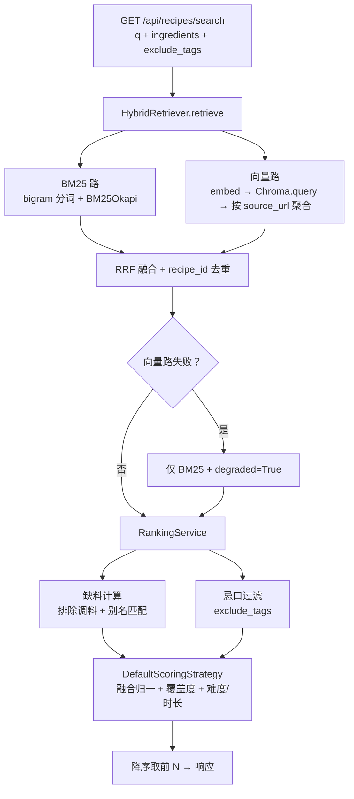

# P2 检索层 —— 实施计划

> 阶段状态：**P2 计划已定稿（待实施）**。前置：P0（2026-08-28）、P1（2026-08-29）均已完成并验收。本文档依据 [docs/PLAN.md](PLAN.md) §2.1/§4/§7、P1 实际落地的接口与 Chroma 约定（[P1_PLAN.md](P1_PLAN.md) §11、[P1_COLLECTION_DESIGN.md](P1_COLLECTION_DESIGN.md) §16）编写，是 P2 的唯一实施依据；实施完成后回填第 9 节验收结果。

## 1. 目标与范围

### 1.1 目标

交付**混合检索 + 评分排序**层：BM25（中文 bigram 分词）+ Chroma 向量双路召回，RRF 融合；缺料计算（调料排除）；默认评分策略（覆盖度优先 + 融合分 + 难度/时长微调）；`GET /api/recipes/search` 验证端点；食材联想向量兜底（承接 PLAN.md 8.8）；`retrieve`/`rank` LangGraph 节点填充；召回评测脚本与性能基线；**全链路鲁棒性（依赖故障降级、输入边界、并发与一致性防护、孤儿块自愈）作为验收硬门禁**。

### 1.2 范围外（留给后续阶段）

- LLM 食材识别、四级词典映射、忌口过滤、推荐文案生成、`POST /api/recipes/recommend`（P3，501 保持不变）；
- 前端（P4）；全量压测、限流、LangSmith 评测（P5）；
- Elasticsearch 实现（仅预留接口，数据量超 5 万再评估）。

## 2. 前置条件（P0/P1 实际现状）

- `Retriever` 抽象：`async retrieve(query: str, top_k: int = 50) -> list[RecipeCandidate]`；`RecipeCandidate{recipe_id, title, match_score, missing_ingredients}`。
- `ScoringStrategy` 抽象：`async score(candidate: RecipeCandidate, query: str) -> float`。
- Chroma 集合 `recipe_docs`（cosine）：块元数据含 `source_url`、`title`、`site`、`chunk_index`、`unit_type`（header/ingredients/steps）、`step_start/end`；**无 `recipe_id`**（P2 需经 `source_url` 关联 MySQL）；`ChromaStore` 目前无 `query` 方法。
- 嵌入：`OpenAICompatibleEmbeddings.embed_texts`（`EMBEDDING_API_KEY` 缺失时构造即抛错，P2 需按“无 key → 跳过向量路”处理）。
- MySQL：`recipes`（`source_url` 唯一）、`recipe_ingredients`、`ingredients`（调料 `category='调料'`）、`recipe_tags`/`tags` 均已就绪，P1 已写入 7 条真实菜谱 + 19 个语义块。
- `tests/conftest.py` 提供测试库迁移 + 词典种子夹具；测试离线可跑（MockTransport / FakeEmbeddings 模式）。

## 3. 设计决策

### 3.1 BM25 语料与中文分词

- 新依赖 `rank-bm25>=0.2`（`BM25Okapi`），不引入 jieba。
- **中文分词用字符 bigram**：查询与语料同一规则（连续中文按相邻两字切 token，非中文按空白/标点切），避免整句单 token 导致 BM25 失效；评测不达标时再评估 jieba。
- 语料文本（每道菜一条）：`标题 + 描述 + 食材名（非调料）+ 调料名 + 标签名`。
- **缓存键 = (recipes 行数, max(id))**：`retrieve` 前校验，数据变化自动重建；采集入库后无需手动刷新。
- 兜底：语料为空 → 返回空候选；构建失败 → ERROR 日志 + 空候选（不 500）。

### 3.2 Chroma 查询（新增 `ChromaStore.query`）

- `ChromaStore` 新增方法（向后兼容）：
  ```python
  async def query(self, query_embeddings: list[list[float]], n_results: int, where: dict | None = None) -> list[dict]
  ```
  返回命中块 `{id, document, metadata, distance}`；内部 `asyncio.to_thread` 包同步 `collection.query(...)`，`include=["documents","metadatas","distances"]`。
- **块 → 菜谱聚合（证据均值，修订）**：按 `metadata["source_url"]` 分组，每道菜的向量项 = `rrf(该菜在 top_n 内的块位次列表, k, w_vector)`（块级 RRF 贡献均值，距离只决定块序、不进分数，单点幸运块被稀释）；再用 `source_url IN (...)` 一次查询 MySQL 映射到 `recipe_id`/`title`。

### 3.3 HybridRetriever（实现 `Retriever`）

```python
class HybridRetriever(Retriever):
    async def retrieve(self, query: str, top_k: int = 50) -> list[RecipeCandidate]: ...
```

- BM25 路：`bm25.search(query, top_k * 2)` 返回 `(recipe_id, score)`。
- 向量路（修订）：`EMBEDDING_API_KEY` 存在且 Chroma 有数据时启用；`embed_texts([query])` → `chroma.query(n_results=top_k * 4)` → **按 `RETRIEVAL_VECTOR_MAX_DISTANCE=0.5` 过滤噪声块**（真实嵌入下无关查询距离 ≥0.52、相关查询 ≤0.5，可干净分隔）→ 聚合；**四态**：① 跳过/失败（无 key/集合空/异常）→ BM25-only + `degraded=True`；② 成功但过滤后 0 命中 → BM25-only + `degraded=False`（正常无匹配）；③ 部分孤儿 → 保留有效 + WARN；④ 全部孤儿 → 整路丢弃 + `degraded=True`。
- 融合（量纲卡死）：唯一原语 `rrf(ranks, k, w) = w * mean(1/(k+r))`，rank 为 1 基正整数、空证据贡献 0；BM25 项 `rrf([rank_bm25], k, w_bm25)`、向量项 `rrf(该菜块位次列表, k, w_vector)`，两路共用同一 `k=60` 与权重语义，配置校验 `k>0` 且 `w_bm25+w_vector=1`；只出现在单路时按单路计；按 `recipe_id` 去重合并。
- 输出：`RecipeCandidate{recipe_id, title, match_score=fusion, missing_ingredients=[], degraded}`。

### 3.4 缺料计算（调料排除）

```python
class MissingIngredientsCalculator:
    def for_recipes(self, recipe_ids, available_names) -> dict[int, MissingInfo]: ...
```

- 查询 `recipe_ingredients JOIN ingredients`，**排除 `category='调料'`**；`essential_total` = 非调料且 `is_essential=True` 的条数。
- 可用食材解析（修订：纯精确匹配，删除“包含”子串匹配防误召回）：先按 `name` 精确相等 → 再按 `aliases` 精确相等 → 得到可用 `ingredient_id` 集合；词典未命中的可用名按“名称相等”兜底匹配。
- `missing_ingredients` = 必需且 `ingredient_id` 不在可用集合中的食材名；全部覆盖则为空。

### 3.5 DefaultScoringStrategy（实现 `ScoringStrategy`）

- `score(candidate, query)`：`score = w1*fusion_norm + w2*coverage + w3*difficulty_bonus + w4*time_bonus`。
- `fusion_norm`：批内按最大融合分归一（`match_score / max`，最大为 0 时取 0）。
- `coverage` = `(essential_total - len(missing_ingredients)) / essential_total`；`essential_total=0` 时记 1（无必需食材不惩罚）。
- `difficulty_bonus` / `time_bonus`：默认实现简单度偏好（难度 1 → +1、2 → +0.5、3 → 0；时长 ≤30min → +1，≤60min → +0.5，否则 0），权重默认各 0.05。
- 默认权重：`w_fusion=0.4`、`w_coverage=0.5`、`w_difficulty=0.05`、`w_time=0.05`（配置可调）。
- **排序（修订：覆盖率先行硬保证）**：最终排序为字典序 `(len(missing) 升序, score 降序, recipe_id 升序)`——缺 0 料永远排在缺 1 料前，加权公式仅作同缺料数内的决胜分（线性加权无法对任意 essential_total 保证覆盖优先）。

### 3.6 RankingService（编排 retrieve → 过滤 → 评分）

- 输入：`query`、`available_ingredients: list[str]`、`exclude_tags: list[str]`、`top_k`。
- 流程：`HybridRetriever.retrieve` → 缺料计算 → **忌口过滤**（候选 `recipe_tags JOIN tags` 命中 `exclude_tags` 即剔除）→ 融合分批内归一 → `DefaultScoringStrategy.score` 逐候选 → **字典序（缺料数升序 → 评分降序 → recipe_id 升序）** → 取前 N。
- 输出：`list[RecipeCandidate]`（含 `missing_ingredients`、`essential_total`、`degraded` 标记与 `notice`）。

### 3.7 验证 API

`GET /api/recipes/search?q=&ingredients=&exclude_tags=&limit=10`（**注册在 `/{recipe_id}` 之前**，避免被路径参数路由吞掉）：

- `q`：必填（BM25/向量文本查询）；`ingredients`：逗号分隔可用食材；`exclude_tags`：逗号分隔忌口标签；`limit`：1–50。
- 响应 `SearchResponse{recipes: list[RecipeCandidateOut], degraded: bool, notice: str | None}`；`RecipeCandidateOut{recipe_id, title, match_score, missing_ingredients}`。
- 空结果：返回空列表 + `notice="未找到匹配菜谱，可补充食材或放宽忌口"`（兜底矩阵）。

### 3.8 食材联想向量兜底（承接 PLAN.md 8.8）

- 新增 `scripts/index_ingredients.py`：把 `ingredients`（name + aliases）嵌入 Chroma 集合 `ingredients_docs`（id=`ingredient_id`，metadata `{ingredient_id, name}`），幂等 upsert。
- `/api/ingredients/search`：先走现有 LIKE；结果不足 `limit` 且嵌入/向量可用时，用向量召回补充合并去重；**响应结构不变**；任一步失败自动回退 LIKE-only（degraded 不改变响应形状）。

### 3.9 LangGraph 节点填充

- `retrieve_node`（修订：查询源锁定）：`CookState` 新增 `query` 字段；以 `state.query`（strip）为唯一检索文本调 `RankingService.rank(query=..., available_ingredients=state.ingredients, ...)`，`state.ingredients` 仅进缺料计算；`query` 为空 → 空候选 + notice“缺少查询文本”，不做食材拼接兜底。
- `rank_node`：调评分后写 `state.ranked`（Top-5）。
- `parse/link/filter/generate` 保持 P3 占位；图仍可编译、可跑“检索→排序”部分流程（新增测试）。

### 3.10 鲁棒性设计（全链路降级契约）

**原则**：任何外部依赖（MySQL / Chroma / Embedding）故障都不得让检索端点 500 或崩溃 worker；输入非法返回 4xx；仅程序缺陷允许 500（必须落结构化 ERROR 日志，不泄露内部细节）。

| 故障 / 边界 | 行为 |
|---|---|
| MySQL 不可用 / 查询异常 | 返回 503 + `notice`（与 `/health/ready` 语义一致），ERROR 日志，不缓存半结果 |
| Chroma `query` 抛错 / 集合空 | 跳过向量路，仅 BM25 + `degraded=True` |
| Embedding 无 key / 超时 / 5xx | 跳过向量路（当次请求熔断），BM25-only + `degraded=True` |
| BM25 语料为空 | 正常空数据 → 空列表 + 空结果 `notice`，`degraded=False` |
| BM25 语料构建失败（有旧缓存） | 旧缓存继续服务 + `degraded=True` + notice“关键词索引更新失败，已回退缓存数据” + ERROR |
| BM25 语料构建失败（无缓存 + MySQL 异常） | 抛 `RetrievalUnavailableError` → 503 |
| BM25 语料构建失败（无缓存 + 非 MySQL） | 空列表 + `degraded=True` + notice，不 500 |
| 向量路成功但 0 命中 | BM25-only + `degraded=False`（正常无语义匹配，非故障） |
| Chroma 命中但 MySQL 无此菜谱（孤儿块） | 部分孤儿 → 保留有效 + WARN；**全部孤儿 → 向量路整路丢弃 + `degraded=True`**；`scripts/cleanup_orphan_chunks.py` 定期清理 |
| `essential_total=0` / 融合 max=0 | 覆盖率记 1、归一化记 0（除零防护） |
| 输入超长 / 非法字符 | `q ≤ 200`、`ingredients ≤ 30`、单项 ≤ 50、`exclude_tags ≤ 20`、`limit ≤ 50`；统一 400 |
| 分数并列 | 按 `recipe_id` 升序稳定排序（确定性输出） |
| 并发重建 BM25 语料 | `asyncio.Lock` + 双缓冲（构建完原子替换引用），请求不读半构建状态 |
| 重复候选 / 脏数据 | RRF 合并按 `recipe_id` 去重；语料文本清洗控制字符并截断上限 |
| 未预期异常 | 结构化 ERROR 日志（事件 `retrieval.search.failed` + traceback）→ 500，响应不泄露内部细节 |

实现要求：

- 所有 MySQL 查询参数化 + `pool_pre_ping`（已有）；Chroma / BM25 同步调用一律 `asyncio.to_thread`，不阻塞事件循环。
- 事件日志：`retrieval.query.started / done / failed / degraded`，含 `duration_ms`、`candidates`、`degraded_reason`。
- 新增 `scripts/cleanup_orphan_chunks.py`：扫描 Chroma `source_url` 与 MySQL 求差，删除孤儿块；支持 `--dry-run`，幂等（防误删）。

## 4. 关键变更（接口 / 文件 / 配置）

### 4.1 接口变更（向后兼容）

- `RecipeCandidate` 新增可选字段 `essential_total: int = 0`、`degraded: bool = False`（P0/P1 已有构造不受影响）。
- `ChromaStore` 新增 `query(...)` 方法（P1 方法全部保留）。
- `Retriever` / `ScoringStrategy` 抽象签名不变。

### 4.2 新增 / 修改文件

```
app/retrieval/__init__.py
app/retrieval/errors.py          # A RetrievalUnavailableError（MySQL 故障 → 503）
app/retrieval/fusion.py          # A rrf 原语（量纲卡死，两路共用）
app/retrieval/bm25.py            # A BM25Corpus：语料构建、bigram 分词、缓存键、search
app/retrieval/hybrid.py          # A HybridRetriever（RRF 融合 + 向量聚合 + 降级）
app/retrieval/missing.py         # A MissingIngredientsCalculator
app/retrieval/scoring.py         # A DefaultScoringStrategy
app/retrieval/ranking.py         # A RankingService（含忌口过滤）
app/core/retriever.py            # M RecipeCandidate + essential_total/degraded
app/vector_store.py              # M + query()/delete_ids()/get_chunk_metadata(None)
app/api/routes/recipes.py        # M + GET /search（注册在 /{recipe_id} 之前）
app/api/routes/ingredients.py    # M + 向量兜底
app/graph/nodes.py               # M 填充 retrieve_node / rank_node
app/schemas/recipes.py           # M + RecipeCandidateOut / SearchResponse
scripts/index_ingredients.py     # A 食材词典向量化
scripts/seed_synthetic_recipes.py# A 合成评测数据（测试/评测共用）
scripts/eval_retrieval.py        # A 50 条评测：recall@5 / coverage，单路 vs 混合
scripts/cleanup_orphan_chunks.py # A 孤块清理（--dry-run）
migrations/versions/b2e7f1c4a9d3 # A recipes.updated_at（DDL 级 ON UPDATE CURRENT_TIMESTAMP(3)）
tests/test_bm25.py               # A
tests/test_hybrid_retriever.py   # A
tests/test_missing_ingredients.py# A
tests/test_scoring.py            # A
tests/test_search_api.py         # A
tests/test_retrieval_nodes.py    # A
tests/test_ingredients_vector.py # A
```

### 4.3 配置新增（`app/config.py` / `.env.example`）

```text
RETRIEVAL_TOP_K=50
RETRIEVAL_FUSION_RRF_K=60
RETRIEVAL_BM25_WEIGHT=0.5
RETRIEVAL_VECTOR_WEIGHT=0.5
RETRIEVAL_VECTOR_QUERY_MULTIPLIER=4
RETRIEVAL_VECTOR_MAX_DISTANCE=0.5
SCORING_W_FUSION=0.4
SCORING_W_COVERAGE=0.5
SCORING_W_DIFFICULTY=0.05
SCORING_W_TIME=0.05
CHROMA_INGREDIENTS_COLLECTION=ingredients_docs
```

### 4.4 依赖

- 新增 `rank-bm25>=0.2`（已装 0.2.2，纯 Python 无 wheel 风险）。
- 表结构：`recipes.updated_at`（迁移 `b2e7f1c4a9d3`，`DATETIME(3) NOT NULL DEFAULT CURRENT_TIMESTAMP(3) ON UPDATE CURRENT_TIMESTAMP(3)`，DDL 级强制，任何 SQL 更新路径均刷新）。

## 5. 核心流程



## 6. 实施顺序

1. 依赖与配置：`rank-bm25` → `uv sync`；`config.py` / `.env.example` 新增检索/评分配置。
2. 数据层：`ChromaStore.query()`；`RecipeCandidate` 扩展字段。
3. BM25：`app/retrieval/bm25.py`（语料构建、bigram 分词、缓存键、search）+ 单测。
4. 缺料与评分：`missing.py` + `scoring.py` + 单测。
5. 混合检索：`hybrid.py`（RRF + 向量聚合 + 降级）+ 单测（FakeEmbeddings + 临时 Chroma）。
6. 编排与 API：`ranking.py` + `GET /api/recipes/search` + schema + 路由顺序修正。
7. LangGraph：填充 `retrieve_node` / `rank_node` + 部分流程测试。
8. 食材联想向量兜底：`index_ingredients.py` + 路由改造 + 测试。
9. 评测与性能：`seed_synthetic_recipes.py` + `eval_retrieval.py`（50 条用例 + 单路对比）；1k/5k 合成数据记录 BM25 构建与查询耗时基线。
10. 鲁棒性：检索超时与并发锁、输入上限校验、孤儿块清理脚本 + 故障注入测试（mock Chroma/嵌入/MySQL 故障）。
11. 文档同步（PLAN.md 阶段状态、README、DB.md 无需改表）→ 全量测试跑绿 → 回填第 9 节验收结果。

## 7. 测试与验收门禁

### 7.1 功能测试

- **BM25**：bigram 分词正确（“土豆鸡蛋”与“鸡蛋土豆”命中同一批）；中文关键词“土豆”能召回含别名“马铃薯”的菜谱（语料含别名）；语料为空返回空。
- **向量聚合**：FakeEmbeddings + 临时 Chroma，多块菜谱按 `source_url` 聚合取最优分；`query` 无结果返回空。
- **RRF 融合**：仅 BM25 / 仅向量 / 双路命中时排序符合 `k=60` 预期；去重无重复 `recipe_id`。
- **降级**：无 `EMBEDDING_API_KEY` 或 Chroma 空 → 仅 BM25 且 `degraded=True`；嵌入抛错不 500。
- **缺料**：调料不参与缺料；别名命中不算缺；全覆盖 → `missing_ingredients=[]`；`essential_total=0` 不惩罚。
- **评分**：覆盖度优先（缺 0 料 > 缺 1 料）；`exclude_tags` 命中剔除；权重配置生效。
- **API**：`/api/recipes/search` 返回结构正确；`ingredients`/`exclude_tags` 逗号解析；空结果带 `notice`；`/search` 与 `/{recipe_id}` 路由不冲突（`/search` 不被吞）。
- **LangGraph**：`build_graph()` 跑“retrieve → rank”部分流程，`state.candidates/ranked` 有值且按分降序。
- **食材联想向量兜底**：LIKE 不足时向量补充合并去重；向量不可用时回退 LIKE-only，响应形状不变。
- **评测脚本**：50 条合成用例，`recall@5 ≥ 0.7`、混合 ≥ 单路（BM25-only 或 vector-only）为 P2 基线。
- **故障注入（鲁棒性门禁）**：mock Chroma.query 抛错 → 仅 BM25 + `degraded`；mock 嵌入抛错/无 key → 同上；MySQL 断连 → 503 + `notice` 不崩溃；BM25 语料为空 → 空结果 + `notice`；孤儿块（Chroma 有、MySQL 无）→ 丢弃 + WARN。
- **边界与并发**：`essential_total=0`、融合 max=0、分数并列排序稳定；超长 `q`、30+ 食材、非法字符 → 400；10 并发请求检索不报错并记录 P95；`cleanup_orphan_chunks.py` 的 dry-run / 真实删除在临时 Chroma 上幂等。

### 7.2 性能门禁（本机基线，记录不设硬阈值，全量压测归 P5）

- BM25 语料构建：1k / 5k 条耗时记录。
- 检索 P95：`search` 空库/1k/5k 三条基线（目标参考：混合检索 < 200ms，BM25-only < 100ms）。
- 向量路：FakeEmbeddings 下 query + 聚合耗时；真实嵌入耗时以 P1 观测为准。

### 7.3 安全门禁

- 全量 SQL 参数化（`IN`、`LIKE` 均绑定参数）；`q`/`ingredients`/`exclude_tags` 长度与字符校验（防超长与注入）。
- 嵌入密钥仅环境变量；无密钥时走降级而非报错。
- `uv lock --check`、`uv audit` 通过；新增依赖无已知漏洞。

### 7.4 验收命令

```powershell
uv sync
uv run alembic upgrade head
uv run python scripts/seed_dictionary.py
uv run pytest
uv run python scripts/seed_synthetic_recipes.py --count 50     # 合成评测数据
uv run python scripts/eval_retrieval.py                        # recall@5 / 单路对比
uv run uvicorn app.main:app
# 浏览器 / curl：GET /api/recipes/search?q=土豆%20鸡蛋&ingredients=土豆,鸡蛋&limit=10
```

全部通过即 P2 完成；结果回填第 9 节。

## 8. 假设

- Chroma 块级数据以 `source_url` 为关联键（P1 已定），P2 通过 MySQL 反查 `recipe_id`，不修改 P1 写入的元数据。
- BM25 用字符 bigram 分词（不引入 jieba），评测不达标时再评估；数据量 > 5 万时按接口替换 Elasticsearch。
- P2 不改变 `POST /api/recipes/recommend`（仍 501，P3 实现）；`/api/recipes/search` 是检索层验证端点，可被 P3 内部复用。
- 调料缺料惩罚规则沿用 P1 约定（调料不参与缺料）；可用食材未入词典时按名称相等兜底，P3 词典映射后更准。
- 向量路仅在 `EMBEDDING_API_KEY` 存在且集合非空时启用，否则静默降级 BM25-only；`degraded` 随响应返回。
- 测试离线可跑：合成数据 + FakeEmbeddings + 临时 Chroma 目录；真实数据评测在 P1 数据基础上人工复核。
- 检索端点对依赖故障降级（不 500、不崩溃、响应结构稳定）属验收项，故障注入测试纳入完成定义；孤儿块清理脚本纳入 P2 范围。

## 9. 验收结果（实施后回填）

| 项目 | 结果 |
|---|---|
| 依赖安装（rank-bm25） | 完成：rank-bm25==0.2.2，`uv sync` / `uv lock --check` 通过 |
| BM25 / 向量 / RRF / 降级 | 完成：bigram 分词、缓存探针 `(COUNT(*), MAX(id), MAX(updated_at))` 双缓冲 + 锁、`rrf()` 原语（量纲卡死）、向量证据均值聚合 + 距离阈值 0.5、四态降级与全孤儿降级、`updated_at` 由 DDL 强制（bulk update 实测刷新） |
| 缺料与评分 | 完成：调料排除、可用食材纯精确匹配（`椒`/`油` 不误匹配）、缺料数优先字典序（缺 0 料恒排最前）、权重配置生效 |
| search API 与路由 | 完成：`GET /api/recipes/search` 注册于 `/{recipe_id}` 前；`q`/`ingredients`/`exclude_tags`/`limit` 校验 400；MySQL 故障 503；空结果返回 `notice="未找到匹配菜谱，可补充食材或放宽忌口"`；真实环境实测 `degraded=false` |
| LangGraph 部分流程 | 完成：`CookState.query` + `retrieve_node`（query 为唯一检索源）/ `rank_node`（Top-5），图可编译跑通 |
| 食材联想向量兜底 | 完成：`index_ingredients.py` 真实嵌入 52 条写入 `ingredients_docs`；LIKE 不足时向量补充合并去重，失败回退 LIKE-only |
| 评测（recall@5 / 单路对比） | 完成：50 用例（38 有效），BM25-only recall@5=0.755 ≥0.7、coverage=0.947；混合（伪向量 1024 维）=0.755 ≥ 单路 |
| 性能基线 | 完成（本机）：1k 语料构建 113.1ms / 查询 P95 23.0ms；5k 语料构建 397.2ms / 查询 P95 6.4ms |
| 故障注入与降级 | 完成：Chroma/embed 抛错或缺 key → BM25-only + `degraded=True`；向量 0 命中 → 不降级；MySQL 断连 → 503；语料重建失败四态；全孤儿 → degraded |
| 孤儿块清理 | 完成：`cleanup_orphan_chunks.py --dry-run` 真实库 0 孤儿；dry-run/真实删除单测通过 |
| 输入边界与并发 | 完成：超长/控制字符/项数上限 400；并发重建锁 + 双缓冲不报错；分数并列按 recipe_id 稳定排序 |
| 测试与安全核验 | 完成：`uv run pytest` 134 全绿（P1 81 + P2 新增 53）；全量 SQL 参数化；真实环境 `uvicorn` 实测 `/health/ready` 200、混合检索 `degraded=false` |
