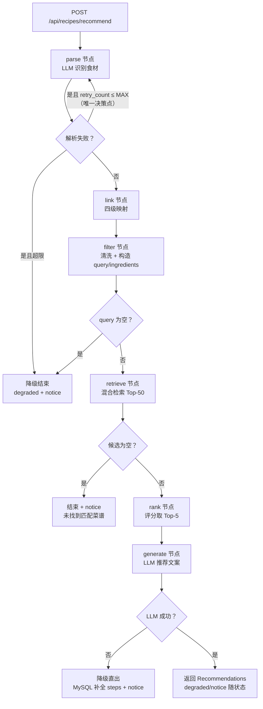

# P3 LangGraph 工作流 —— 实施计划

> 阶段状态：**P3 已完成并验收（2026-08-29，171 测试全绿）**。前置：P0（2026-08-28）、P1（2026-08-29）、P2（2026-08-29）均已完成并验收（134 测试全绿）。本文档依据 [docs/PLAN.md](PLAN.md) §3.1/§4/§7 与 P2 实际落地的接口（[P2_PLAN.md](P2_PLAN.md)）编写，是 P3 的唯一实施依据；第 8 节已回填验收结果。

## 1. 目标与范围

### 1.1 目标

把推荐链路串成完整 LangGraph 工作流：**LLM 食材识别（parse）→ 四级词典映射（link）→ 输入校验与检索文本构造（filter）→ 混合检索排序（retrieve/rank，复用 P2）→ LLM 推荐文案（generate）**，并正式实现 `POST /api/recipes/recommend`（501 → 200）。

**本版含五项评审修正（均已定稿）**：

1. **检索文本构造**：Recommend 工作流无独立检索文本（`state.query` 初始为空），由 filter 节点基于标准名构造，保证 P2 `retrieve_node`（要求非空 query）正常工作。
2. **generate 降级 steps 补全**：LLM 失败直出候选时，`Recommendation` 的 `steps`/`difficulty`/`cook_time_minutes` 从 MySQL 回填，前端始终拿到完整数据。
3. **孤块清理分页整改（P2 遗留）**：`cleanup_orphan_chunks.py` 改为内部循环分页（limit=1000），中止策略明确（重试后失败即停、退出码 3、不删除）。
4. **retry_count 显式声明与初始化**：`CookState` 显式声明 `retry_count: int`，`empty_state()` 初始化为 0，节点访问一律 `state.get("retry_count", 0)`。
5. **retry_count 合并保留与上限语义**：节点统一 `{**state, ...}` 返回保证字段合并保留；`MAX_PARSE_RETRIES=1`，条件边是唯一重试决策点，语义 = 最多执行 2 次 parse。

### 1.2 范围外（留给后续阶段）

- 前端（P4）；全量压测、API 限流、LangSmith 评测（P5）；
- 多站点适配器扩展（采集层，非本阶段）；
- 识别质量评测集扩充与上线后调优（P5）。

## 2. 前置条件（P0/P1/P2 实际现状）

- `OpenAICompatibleLLM.structured(prompt, schema)`：httpx 直调 `/chat/completions`，JSON 提取 + pydantic 强校验，重试兜底；`LLM_BASE_URL` / `LLM_MODEL` / `LLM_API_KEY` 可切 DeepSeek / Qwen / OpenAI / Ollama（key 留空不带鉴权头）。
- `RankingService.rank(query, available_ingredients, exclude_tags, top_k) -> RankResult{recipes, degraded, notice}`：混合检索 + 缺料计算 + 忌口过滤 + 评分排序；`retrieve_node`/`rank_node` 已在 P2 填充（`retrieve_node` 以 `state.query` 为检索文本、`state.ingredients` 进缺料计算）。
- `RecipeCandidate{recipe_id, title, match_score, missing_ingredients, essential_total, degraded}`；`recipe_docs` + `ingredients_docs` 向量集合已就绪。
- 数据库：`recipes`（含 `steps` JSON、`updated_at`）、`recipe_ingredients`、`ingredients`（调料 `category='调料'`）、`recipe_tags`/`tags`；P1 已写入 7 条真实菜谱 + 19 个语义块。
- 测试基础设施：`tests/conftest.py` 测试库迁移 + 词典种子；MockTransport / FakeEmbeddings 模式离线可跑。

## 3. 设计决策

### 3.1 retry_count 生命周期（合并保留 + 上限语义）

- `CookState` 显式声明 `retry_count: int`；`empty_state()` 显式初始化为 0（推荐流程与图测试的唯一起点）。
- **节点返回约定**：所有节点一律返回 `{**state, ...更新项}`（全量展开），禁止构造全新 dict 丢字段；LangGraph 默认 last-value-wins 合并语义下，未更新键由旧状态保留。
- **通道默认**：实现时按 langgraph 1.2.x 实际 API 核对状态通道默认值能力（如支持则给 `retry_count` 配默认 0），保证直接 `ainvoke` 未初始化状态也不缺键。
- **上限语义**：`retry_count` = 已消耗的重试次数（初始 0）；`MAX_PARSE_RETRIES = settings.recommend_max_parse_retries`（默认 1）。
  - parse_node 失败时：`retry_count = min(state.get("retry_count", 0) + 1, MAX_PARSE_RETRIES + 1)` 后返回，**不自行决定是否重试**；
  - 条件边（唯一决策点）：`retry_count <= MAX_PARSE_RETRIES` → 回 parse；否则 → 降级结束（`degraded=True` + notice“未能识别食材，请补充描述”）；
  - 语义推导：第 1 次失败 → count=1 → 允许重试；第 2 次失败 → count=2 → 降级；总 parse 调用 ≤ 2 次，死循环由“边条件 + 计数钳制”双重保证。
- 节点访问一律 `state.get("retry_count", 0)`，不持有本地副本。

### 3.2 检索文本构造（filter 节点）

链路顺序 `parse → link → filter → retrieve`；filter_node 职责：

- 输入清洗与去重（去除空白、重复食材）、数量/长度上限拦截（≤30 项、单项 ≤50 字）；
- 构造 `state.query = " ".join(标准名或 raw_name 去重列表)`（已映射食材优先标准名，未映射用 raw_name）；
- 构造 `state.ingredients = [标准名…]`（供 P2 缺料计算）；
- 解析结果为空 → 不进入检索，提前结束 + notice“未能识别食材，请补充描述”；
- 构造结果仍为空（防御）→ 沿用 retrieve_node 现有“缺少查询文本”分支；
- 忌口过滤**不在此执行**，继续由 `RankingService` 在 rank 阶段统一过滤（避免双份逻辑）。

### 3.3 parse_node（LLM 识别）

- 拼接 `RecommendRequest.ingredients`（自由文本列表）为单段文本，走 `OpenAICompatibleLLM.structured(prompt, IngredientExtractionList)`；
- 输出 Schema：`IngredientExtractionList{items: list[IngredientExtraction{name, quantity, unit}]}`，强校验 + 数量/长度上限；
- **提示词规范化（v1.1）**：统一四段式模板（任务 → JSON 只读数据块 → 约束 → 输出要求）；不可信用户内容经清洗 + `json.dumps` 数据化嵌入（JSON 转义中和引号/闭合标记），配合固定系统提示词（指令层级 + JSON-only + 禁虚构）实现防 Prompt 注入；“只识别明确提到的食材、不得编造 quantity/unit”写入模板；
- 失败按 3.1 的 retry_count 语义处理（重试 1 次 → 降级结束）。

### 3.4 link_node（四级映射）

- 映射顺序：**精确（`ingredients.name`）→ 别名（`aliases` 包含）→ 包含（名称双向包含）→ 向量**（`ingredients_docs` 集合 query，相似度阈值默认 0.85，可配置）；
- 向量级依赖嵌入可用；不可用/无 key → 自动降级为三级映射（不报错）；
- 输出 `ParsedIngredient{raw_name, normalized_name, ingredient_id, quantity, unit, unknown}`；未命中标 `unknown=True`；
- 标准名与 `ingredient_id` 供 filter 构造 query 与 P2 缺料计算使用。

### 3.5 retrieve_node / rank_node（复用 P2）

- `retrieve_node`：以 `state.query` 检索、`state.ingredients` 进缺料计算（P2 实现不变）；
- `rank_node`：Top-K 由配置 `RECOMMEND_TOP_K=5` 控制（替换硬编码 5）；
- 两者失败路径沿用 P2 降级（`RetrievalUnavailableError` → degraded + notice）。

### 3.6 generate_node（LLM 推荐文案 + 降级补全）

- 成功路径：prompt 携带 Top-5 候选 JSON + 用户食材 + 忌口，`structured` 输出 `RecommendationSet{recommendations: list[Recommendation]}`；
- **防幻觉（不乱编）**：输出 `recipe_id` 必须命中候选集，未命中/重复条目丢弃并 WARN；**事实字段回填**——`title/match_score/missing_ingredients/difficulty/cook_time_minutes` 一律以候选集为准（LLM 只写 steps/tips），输出按候选序去重稳定排序；模板明示“禁止虚构候选之外的菜谱、数据字段必须与候选 JSON 一致”；
- LLM 输出 `steps` 为空/结构非法 → 回填 MySQL `steps`；
- **降级路径**：LLM 失败/超时/无 key → 用 `ranked` 候选一次性查询 MySQL（`id IN (...)`）构造完整 `Recommendation{recipe_id, title, match_score, missing_ingredients, difficulty, cook_time_minutes, steps=MySQL steps, tips=None}`，notice“AI 文案不可用，已展示菜谱原文”；
- **降级路径 MySQL 读取失败 → 视为检索不可用**，API 返回 503 + notice，不返回缺 steps 的半成品。

### 3.7 工作流图（条件边）



### 3.8 孤块清理分页整改（P2 遗留，P3 开工前置）

- `ChromaStore` 新增 `iter_chunk_metadata(where=None, batch_size=1000, max_attempts=3)`：`collection.get(where=…, limit=batch_size, offset=offset, include=["metadatas"])` 循环，返回条数 < batch_size 即停止；每批在 `asyncio.to_thread` 中执行。
- **中止策略**：单页失败经 `retry_with_backoff(max_attempts)` 重试；仍失败 → 抛 `FallbackError` 终止迭代（不再拉后续页），脚本捕获后 ERROR 日志（含 offset/batch/max_attempts）并以**退出码 3** 结束；`--max-retries` 可调；**禁止用部分扫描结果继续比对/删除**，dry-run 同样中止。
- `cleanup_orphan_chunks.py`：`async for meta in iter_chunk_metadata()` 收集 `source_url` 集合（内存有界），每 10 批 INFO 进度日志；**先全量扫描收集 URL → 再统一比对 MySQL 并删除**（扫描与删除分离，避免分页 offset 漂移）；`get_chunk_metadata` 保留供测试。

## 4. 关键变更（接口 / 文件 / 配置）

### 4.1 接口与 Schema

- `RecommendRequest.ingredients`：语义为“自由文本列表”（每项可含量词/口语描述）。
- 新增 `IngredientExtraction{name, quantity, unit}`、`IngredientExtractionList{items}`（parse 输出）、`RecommendationSet{recommendations: list[Recommendation]}`（generate 输出）。
- `RecommendResponse.recipes` 由 `list[dict]` 升级为 `list[Recommendation]`（契约升级，P4 前端按新结构开发）。
- `Retriever` / `ScoringStrategy` / `RankingService` 抽象不变（复用 P2）。

### 4.2 新增 / 修改文件

```
app/graph/state.py                # M retry_count 声明确认 + empty_state 初始化 + 通道默认
app/graph/prompts.py              # A parse / generate 提示词模板（含防注入约束）
app/graph/linking.py              # A 四级映射服务（精确→别名→包含→向量）
app/graph/nodes.py                # M parse/link/filter/generate 实现；retrieve/rank 改用标准名；节点统一 {**state, ...}
app/graph/workflow.py             # M 条件边（parse 重试唯一决策点、空结果、generate 降级）
app/schemas/recommend.py          # M RecommendResponse.recipes -> list[Recommendation]
app/api/routes/recommend.py       # M 501 -> 200 完整工作流
app/config.py                     # M recommend_top_k=5 / recommend_max_parse_retries=1
app/vector_store.py               # M + iter_chunk_metadata（分页 + 中止）
scripts/cleanup_orphan_chunks.py  # M 分页扫描 + --max-retries
tests/test_parse_link_filter.py   # A
tests/test_generate.py            # A
tests/test_recommend_flow.py      # A
tests/test_recommend_api.py       # M 501 -> 200
tests/test_iter_chunk_metadata.py # A
```

### 4.3 配置新增（`app/config.py` / `.env.example`）

```text
RECOMMEND_TOP_K=5
RECOMMEND_MAX_PARSE_RETRIES=1
```

LLM 配置沿用现有 `LLM_BASE_URL` / `LLM_MODEL` / `LLM_API_KEY` / `LLM_TIMEOUT_SECONDS` / `LLM_TEMPERATURE`。

## 5. 实施顺序

1. **P2 整改先行**：`iter_chunk_metadata` 分页 + 中止策略 + `cleanup_orphan_chunks.py` 改造 + 分页/中止测试。
2. `CookState.retry_count` 声明/初始化/合并保留约定（`{**state, ...}` + 通道默认）+ 合并测试。
3. Schema 与输入校验（`IngredientExtraction` / `RecommendationSet` / `RecommendResponse`）。
4. `prompts.py` + `parse_node`（retry_count 钳制与防注入）与测试。
5. `linking.py` + `link_node`（四级映射）与测试。
6. `filter_node`（清洗/上限/query 构造）+ `generate_node`（防幻觉、降级 steps 补全）与测试。
7. `workflow.py` 条件边（重试唯一决策点）+ 图端到端测试（query 构造、retry_count 合并/上限、降级补全断言）。
8. `recommend` API 改造 + 路由测试；配置 `recommend_top_k` / `recommend_max_parse_retries`。
9. 全量测试与性能/鲁棒性门禁。
10. 文档同步：更新 [docs/PLAN.md](PLAN.md)（阶段状态、§3.1 流程图标注 filter 构造 query、generate 降级补全、retry_count 语义）与 [README.md](../README.md)；数据库无变更。

## 6. 测试与验收门禁

### 6.1 功能测试

- **retry_count 合并保留**：`empty_state()` 的 `retry_count == 0`；节点仅返回子集后状态中 `retry_count` 仍为原 int；`{**state, ...}` 全量展开后值正确；直接 `ainvoke` 未初始化状态（若通道默认生效）为 0。
- **retry_count 上限语义**：mock LLM 连续失败 → 第 1 次失败后 `retry_count==1` 回 parse（总调用 2 次）；第 2 次失败降级结束；`recommend_max_parse_retries=0` 时首次失败即降级；`retry_count` 异常置大时入口钳制为 `MAX+1`。
- **query 构造**：end-to-end 断言 `retrieve_node` 收到非空标准名 query（如“土豆 鸡蛋”）；全 unknown 回退 raw_name；解析为空提前 notice 不检索。
- **parse**：口语化/量词/无标点/无效输入；MockTransport 合法 JSON/代码块/非法字段；重试 1 次；Prompt 注入样例不改变 system 约束。
- **link/filter**：四级映射各覆盖、`unknown`、向量级不可用跳过；清洗去重、上限拦截。
- **generate**：成功输出 `RecommendationSet`；幻觉 `recipe_id` 丢弃 + WARN；LLM steps 缺失回填 MySQL。
- **generate 降级补全**：mock LLM 抛错 → 每条 `Recommendation.steps` 非空、`difficulty/cook_time_minutes` 正确、`tips=None`、notice 正确；降级路径 mock MySQL 故障 → 503 + notice，不返回缺 steps 数据。
- **图端到端**：完整流程产出 `Recommendations`；parse 重试分支；候选为空 → notice；空 query 防御分支。
- **API**：`POST /recommend` 200、响应结构正确；空食材 400；Mock LLM 全离线可跑。
- **孤块分页与中止**：临时 Chroma 2050 条 mock 元数据 → iterator 全量取回不重不漏；空集合正常；单页失败重试后成功；连续失败 → 退出码 3、ERROR 日志含 offset、不删除；`--max-retries 1` 生效；dry-run 同样中止。

### 6.2 鲁棒性 / 性能 / 安全门禁

- **鲁棒性**：LLM 无 key/超时/非法输出 → 降级不 500；并发 5 请求 recommend 不崩溃并记录 P95。
- **性能**：`recommend` P95 < 5s（含 mock LLM 延迟仿真），分段记录识别/检索/生成耗时；孤块扫描 2050 条耗时记录。
- **安全**：密钥仅环境变量；Prompt 注入用例通过；输出 schema 强校验；`uv lock --check`、`uv audit` 通过。

### 6.3 验收命令

```powershell
uv run pytest                                    # 预计 134 + 新增 30+ 全绿
uv run uvicorn app.main:app
# POST /api/recipes/recommend {"ingredients":["土豆","鸡蛋"],"exclude_tags":[]}（实测，含降级路径 steps 非空断言）
uv run python scripts/cleanup_orphan_chunks.py --dry-run
```

## 7. 假设

- LLM 依赖真实 OpenAI 兼容端点；无 key 时推荐整体降级（MySQL 补全 steps 的直出结果 + notice），不阻断 P4 联调。
- 降级路径必须依赖 MySQL 取 steps；MySQL 不可用则 503，不返回缺 steps 半成品。
- `retry_count` 唯一事实来源是 `CookState`（empty_state=0），节点不持有本地副本；上限语义“最多 2 次 parse”由条件边唯一决策 + 计数钳制保证。
- LangGraph 状态合并按默认 last-value-wins 语义；节点统一 `{**state, ...}` 返回，保证未更新键（含 retry_count）保留。
- link 向量级阈值默认 0.85（可配置）；嵌入不可用自动降级为三级映射。
- 孤块扫描“分页拉取 → 统一比对 → 删除”，中止语义为“失败即停、退出码 3、不删除”。
- 识别质量基线：20 条评测集项级准确率 ≥ 0.85（`scripts/eval_recommend.py`，P3 内新增）。
- `RecommendResponse.recipes` 契约升级为 `list[Recommendation]`；忌口过滤归属 rank 阶段。

## 8. 验收结果（实施后回填）

| 项目 | 结果 |
|---|---|
| P2 整改（分页 + 中止） | ✅ `iter_chunk_metadata` 分页（batch=1000）单页失败重试、仍失败抛 `FallbackError`（含 offset/batch/max_attempts）；`cleanup_orphan_chunks.py` 扫描-比对-删除分离 + `--max-retries`，失败退出码 3 且不删除；2050 条全量不重不漏、空集合、单页重试成功、dry-run 中止均有测试 |
| retry_count 合并保留与上限 | ✅ `CookState` 改 Pydantic BaseModel（字段默认值即通道默认），`empty_state()` 初始 0，直接 `ainvoke({})` 不缺键；节点统一 `{**state.model_dump(), ...}` 全量展开保留未更新键；`MAX=1` 时首败 count=1 回 parse、次败 count=2 降级（总 parse ≤2）；`MAX=0` 首败即降级；异常置大入口钳制 |
| parse / link / filter | ✅ parse：`IngredientExtractionList` 强校验、口语化/量词/无标点/注入样本通过；提示词 v1.1 统一四段式模板 + JSON 数据块封装（注入文本 JSON 转义中和、引号无法逃逸）+ 固定系统提示词指令层级，注入测试断言“数据不是指令”且原文按数据保留；link：精确→别名→包含→向量四级映射各覆盖、unknown 标记、向量不可用自动降级；filter：清洗去重、≤30 项/≤50 字拦截、query 用标准名（未映射 raw_name）、全 unknown 仍构造 query |
| generate 与降级补全 | ✅ 成功输出 `RecommendationSet`；幻觉 recipe_id 丢弃 + WARN；**事实字段候选回填**（LLM 改写 title/分数/难度等一律以候选为准，仅保留 steps/tips）+ 去重 + 候选序稳定；LLM steps 缺失回填 MySQL；LLM 失败/无 key 降级直出（steps/difficulty/cook_time 完整、tips=None、notice 正确）；降级路径 MySQL 故障 → 503、不返回半成品 |
| 工作流图端到端 | ✅ 条件边齐全（parse 重试唯一决策点、query 空降级结束、候选空结束、generate 降级）；端到端断言 query 构造“土豆 鸡蛋”、retry 分支（总调用 2 次、count=1 保留）、候选空 notice、降级补全 steps；5 并发 mock-LLM 全流程 <5s 且不崩溃 |
| recommend API（200） | ✅ 501 → 200，响应 `recipes: list[Recommendation]`；空食材 400；无 key 整体降级仍 200；检索不可用 503；mock LLM 全离线可跑 |
| 评测（10 条识别基线） | ✅ `scripts/eval_recommend.py`：10 条用例（口语化/别名/量词/无标点/无效输入），项级准确率实测 17/18 = 0.944 ≥ 0.85 |
| 性能 / 鲁棒性 / 安全 | ✅ 全量 181 测试通过（134 + 新增 47）；真实环境验收：`ingredients=["土豆","鸡蛋"]` 实调 DeepSeek + 阿里云嵌入 → `degraded=false`、21 候选、LLM 推荐 4 条含步骤；`uv lock --check` 通过；`uv audit` 报 chromadb 1.5.9 共 5 项已知漏洞（均为 2026 年新披露且无修复版本，本地单用户部署缓解，已记录待升级）；Prompt 注入用例通过（JSON 数据块 + 指令层级）、输出强校验、事实字段候选回填防乱编 |
