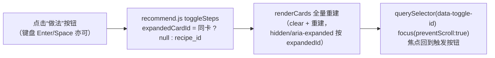

# P4.1 前端视觉与交互优化 —— 实施计划

> 阶段状态：**P4.1 已完成并验收（2026-08-29，194 测试全绿 + 6 条 Playwright 冒烟通过）**。前置：P0（2026-08-28）、P1（2026-08-29）、P2（2026-08-29）、P3（2026-08-29）、P4（2026-08-29，提交 `6930e52`）均已完成并验收。本文档依据 [docs/P4_PLAN.md](P4_PLAN.md) 与前端实际实现（`frontend/`）编写，是 P4.1 的唯一实施依据；第 8 节已回填验收结果。

## 1. 目标与范围

### 1.1 目标

在不改动请求层（api.js）、后端契约与两页结构的前提下，对 P4 前端做**视觉与轻交互优化**：

- **纯净浅色 + 暖橙主色**：收敛多色面板、统一圆角/阴影/间距，降低视觉噪音；
- **卡片分级展示**：推荐卡默认只显示标题/匹配度/缺料/难度时长，做法步骤折叠为“做法”展开（一次只展开一张）；
- **键盘焦点保持**：折叠全量重建后焦点回到触发按钮，不落到 body；
- **抽屉轻交互**：打开聚焦关闭按钮 + 锁定页面滚动，关闭恢复焦点到触发元素；
- 按钮加载态、提示文案精简、移除页脚、新增 favicon。

**本版含评审修正（均已定稿）**：

1. **DOM 生命周期与无状态契约**：折叠切换采用「状态在页面脚本、渲染为全量重建、展开容器常驻 `hidden`」，ui.js 不保留任何节点/监听引用，杜绝内存泄漏，且不破坏 ui.js 无状态契约。
2. **aria-expanded 同步**：每次重渲染按 `expandedCardId` 推导各卡 `hidden` 与按钮 `aria-expanded`，展开 A 自动收起 B 在一次渲染内完成，无中间态；`aria-controls` 指向始终存在的 `steps-{recipe_id}` 容器。
3. **全量重建后的键盘焦点保持**：按钮带稳定 `data-toggle-id`，重渲染后 `focus({ preventScroll: true })` 恢复焦点（ARIA disclosure 模式标准行为）。
4. **favicon 测试同步**：新增 `frontend/favicon.svg` 并同步 `tests/test_frontend.py` 资源完整性检查。

### 1.2 范围外（留给后续阶段）

- 请求层 `api.js`、任务级 registry、后端 API / Schema / 迁移；
- 两页结构（保留推荐主页 `/` 与搜索页 `/search.html` 独立页面）、单页化 / 引入组件框架等大重构；
- 用户反馈 / 收藏闭环、登录、PWA、国际化、全量浏览器回归（P5）。

## 2. 前置条件（P4 前端实际现状）

- 文件：`frontend/{index.html, search.html, css/style.css, js/api.js, js/ui.js, js/recommend.js, js/search.js}`；`tests/test_frontend.py`（四类用例：静态路由 / 资源完整性 / 静态安全扫描 / 调用契约）；`scripts/e2e/`（6 条 Playwright 冒烟）。
- 现状问题（本次优化动机）：卡片平铺展示完整步骤与贴士导致信息密度过高；暖米色底 + 多色面板（蓝 / 琥珀 / 红）色彩面多、不够克制；折叠交互缺失导致键盘焦点管理无从谈起；页脚与冗长 hint 增加纵向噪音。
- 约束（必须保持全绿）：两页 `js/recommend.js` / `js/search.js` 引用、`label for` 与动态 chip id（`ingredient-input` / `search-ingredient-input`）、API 路径字符串、无 `innerHTML` 等危险 DOM API——`tests/test_frontend.py` 现有断言不可破坏。
- 冒烟断言依赖：`smoke_recommend_happy.py` 断言推荐卡 `.recipe-steps` 可见；`smoke_search_detail.py` 断言抽屉 `.recipe-steps` 与 `.drawer-source` 可见——折叠改造需同步更新前者，抽屉不受影响。

## 3. 设计决策

### 3.1 设计令牌（纯净浅色 + 暖橙）

```css
:root {
  --color-bg: #fafaf8;          /* 页面底 */
  --color-surface: #ffffff;     /* 卡片 / 面板 / 抽屉 */
  --color-text: #1f1d1a;        /* 正文 */
  --color-muted: #6b675f;       /* 弱化文本 / 提示 */
  --color-border: #ece8e2;      /* 更轻的边框 */
  --color-primary: #d9772e;     /* 暖橙主色 */
  --color-primary-dark: #b85f1f;
  --color-soft-bg: #f7f5f1;     /* 中性弱背景（贴士 / 缺料 chips） */
  --color-warn-bg: #fff7e0;     /* 降级横幅（琥珀保留） */
  --color-warn-border: #f0d9a0;
  --color-warn-text: #7a5b12;
  --color-error-bg: #fdf0ee;    /* 错误（柔红保留） */
  --color-error-border: #e8b8b1;
  --color-error-text: #9b3228;
  --radius-lg: 12px;            /* 卡片 / 面板 */
  --radius-sm: 8px;             /* 输入 / 按钮 */
  --shadow: 0 1px 2px rgba(31, 29, 26, 0.04), 0 2px 8px rgba(31, 29, 26, 0.05);
}
```

- 收敛彩色面：仅降级横幅（琥珀）与错误（柔红）保留语义色；提示 / 贴士 / 缺料 chips 全部中性化（白底或 `--color-soft-bg` + 边框 + 弱化文字）。
- 按钮 / 输入 / 徽章统一圆角与描边风格；阴影更柔和；间距遵循 4/8px 节奏。

### 3.2 卡片折叠与 DOM 生命周期

- **渲染模型**：每次结果渲染（提交、折叠切换、清空）都是「`clear(container)` + 全量重建卡片」；ui.js **不保留任何节点 / 监听器引用**，旧节点随容器清空被 GC，无增量 DOM 手术、无监听累积。Top-5 规模下全量重建开销可忽略。
- **展开容器常驻**：每张卡始终渲染 `<div id="steps-{recipe_id}" class="recipe-steps-wrap" hidden>`（内含步骤列表与贴士，贴士存在时），折叠只切换 `hidden` 属性，`aria-controls` 恒有效。
- **卡片结构（推荐页）**：
  1. 头行：`h3.card-title` + `.badge`（匹配度百分比）；
  2. 弱化元信息行：难度（★，1–3）/ 时长（分钟），未知则省略；
  3. 缺料行 `.missing`（无缺料显示“无需额外食材”）；
  4. “做法”按钮 `.card-toggle`：`aria-expanded` + `aria-controls="steps-{recipe_id}"` + `data-toggle-id="{recipe_id}"`；
  5. 常驻 `hidden` 展开区：`ol.recipe-steps` + `p.card-tips`（存在时）。
- **搜索页卡片不变**：无步骤、保留“查看详情”按钮（详情走抽屉，抽屉内完整展示步骤）。

### 3.3 无状态契约与状态归属

- 展开状态 `expandedCardId` 由 `recommend.js` 持有（唯一事实来源），ui.js 只读入参 `renderCards(container, recipes, {expandedId, onToggleSteps})` 渲染，内部无展开 / 收起状态。
- “做法”按钮回调：仅更新 `expandedCardId`（同卡再点收起置 `null`）→ 重新调用 renderCards，不做任何直接 DOM 改动。

### 3.4 aria 同步与键盘焦点保持

- **aria 同步**：每次重渲染按 `expandedId` 设置各卡展开区 `hidden` 与按钮 `aria-expanded`（`expandedId === recipe_id` 为 true）；展开 A 自动收起 B 在一次渲染内完成，无中间态。
- **焦点保持**：`toggleSteps` 在重渲染后立即执行 `els.cards.querySelector('[data-toggle-id="' + id + '"]')?.focus({ preventScroll: true })`——焦点始终留在触发按钮（disclosure 模式标准行为），用户可继续 Tab 进入展开区；不依赖销毁前的旧节点引用。

### 3.5 抽屉轻交互（ui.js + search.js）

- `renderDetailDrawer`：打开时聚焦关闭按钮，并给 `document.body` 加 `drawer-open` 类锁滚动；关闭（× / ESC / 遮罩）时移除类、解绑 keydown、清空容器后调用 `onClose`。
- `search.js`：`openDetail` 先捕获 `document.activeElement` 为触发元素；`onClose` 中 `trigger && trigger.isConnected && trigger.focus()` 恢复焦点（防御清空后元素已移除的情况）；详情缓存与同卡防重发逻辑不变。

### 3.6 按钮、文案、页脚与 favicon

- 主按钮 pending 时：`.is-loading`（CSS 圆环伪元素）+ `disabled` + `aria-busy="true"`（推荐 / 搜索两页），文案仍为“推荐中…” / “搜索中…”。
- 文案精简：推荐页副标题“输入家里已有的食材，一键推荐缺料最少的菜谱。”；搜索页副标题“按关键词检索，可附加食材与忌口条件。”；hint 改为“回车添加，最多 30 项”“最多 20 项”“必填，最多 200 字”。
- 移除两页页脚；hero 压缩为标题 + 一行副标题。
- 新增 `frontend/favicon.svg`，两页 `<head>` 添加 `<link rel="icon" href="favicon.svg" type="image/svg+xml">`。

### 3.7 页面-交互数据流（折叠切换）



## 4. 关键变更（接口 / 文件 / 配置）

### 4.1 接口

- **无 API / Schema / 迁移变更**；`api.js` 请求层与任务级 registry 不动。

### 4.2 新增 / 修改文件

```
frontend/css/style.css                # M 设计令牌重写 + 折叠 / 加载态 / 抽屉滚动锁定样式
frontend/index.html                   # M hero / hint 精简、移除页脚、favicon link
frontend/search.html                  # M 同上
frontend/js/ui.js                     # M renderCards 折叠支持（expandedId/onToggleSteps/data-toggle-id/hidden）
                                     #   + renderDetailDrawer 焦点 / 滚动锁定
frontend/js/recommend.js              # M expandedCardId 状态 + toggleSteps 焦点恢复 + is-loading
frontend/js/search.js                 # M openDetail 焦点捕获 + onClose 恢复 + is-loading
frontend/favicon.svg                  # A 站点图标
tests/test_frontend.py                # M 资源完整性（favicon）+ 静态契约（hidden/aria-expanded/data-toggle-id/expandedId/preventScroll）
scripts/e2e/smoke_recommend_happy.py  # M 点击“做法”后断言步骤可见 / aria-expanded=true / 按钮聚焦
```

### 4.3 配置 / 依赖

- 无新增配置与依赖；无第三方资源（favicon 为本地 SVG）。

## 5. 实施顺序

1. `style.css` 设计令牌重写（颜色 / 圆角 / 阴影 / 卡片 / 抽屉 / 按钮加载态 / `drawer-open` 滚动锁定）。
2. 两页 HTML：hero 与 hint 精简、移除页脚、添加 favicon link。
3. `ui.js`：`renderCards` 折叠支持（`expandedId` / `onToggleSteps` / `data-toggle-id` / `hidden` 常驻 / `aria-expanded` / `aria-controls`）；`renderDetailDrawer` 聚焦与滚动锁定。
4. `recommend.js`：`expandedCardId` 状态 + `toggleSteps`（重渲染后 `focus({ preventScroll: true })`）+ 按钮 `.is-loading` / `aria-busy`。
5. `search.js`：`openDetail` 焦点捕获 + `onClose` 焦点恢复 + 按钮加载态；抽屉缓存逻辑不变。
6. `tests/test_frontend.py`：资源完整性新增 favicon 显式断言；静态契约新增 3.4 相关断言。
7. `scripts/e2e/smoke_recommend_happy.py`：点击“做法”后断言步骤可见、`aria-expanded="true"`、按钮聚焦。
8. 全量 pytest + 6 条冒烟联跑 + 浏览器手测 → 回填 §8 验收表并同步 [docs/PLAN.md](PLAN.md) 与 [README.md](../README.md)。

## 6. 测试与验收门禁

### 6.1 功能测试（tests/test_frontend.py 更新）

- **资源完整性**：新增显式断言 `frontend/favicon.svg` 存在且非空、两页 HTML 均引用（现有 `<link href>` 正则已自动覆盖，显式断言防误删）。
- **静态契约**：断言 `ui.js` 含 `hidden`、`aria-expanded`、`data-toggle-id` 处理；`recommend.js` 传入 `expandedId` 且含 `preventScroll` 焦点恢复逻辑（锁定无状态 + aria 同步 + 焦点保持实现，防回归）。
- 其余三类用例（静态路由 / 静态安全扫描 / API 调用契约）保持不变。

### 6.2 冒烟更新

- `smoke_recommend_happy.py`：卡片出现后点击“做法”按钮，断言 `.recipe-steps` 可见、按钮 `aria-expanded="true"`、按钮 `to_be_focused()`；其余 5 条冒烟（autocomplete / exclude_tags / degraded / search / search_detail）不受影响。

### 6.3 手测清单（浏览器验收）

- 折叠：一次只展开一张、再次点击收起、展开 / 收起后布局无抖动；
- 键盘：Enter / Space 切换折叠后焦点始终留在“做法”按钮，不落到 body；
- 抽屉：打开时页面不可滚动；ESC / 遮罩 / × 均可关闭，关闭后焦点回到触发按钮；
- 视觉：浅色主题下推荐 / 搜索 / 降级横幅 / 错误态对比度正常，无多色面板残留；
- 响应式：移动端宽度下卡片、按钮、抽屉布局正确；Tab 焦点可见。

### 6.4 鲁棒性 / 性能 / 安全门禁

- **鲁棒性**：折叠与抽屉交互在外部依赖故障时仍可用（纯前端）；清空 / 重试路径不残留展开状态。
- **性能**（本机基线记录）：无新增请求与第三方资源；折叠为纯前端重渲染（Top-5，<5ms 量级）；样式单文件体积保持轻量。
- **安全**：静态安全扫描仍无 `innerHTML` 等危险 DOM API；无硬编码密钥；外链安全属性不变。
- **验收命令**：

```powershell
uv run pytest                              # 全量用例（含 test_frontend.py 更新）全绿
uv run uvicorn app.main:app                # 浏览器手测清单全过
uv run python scripts/e2e/smoke_*.py       # 6 条冒烟全绿（需已启动服务）
```

## 7. 假设

- 仅优化 `frontend/` + `tests/test_frontend.py` + `scripts/e2e/smoke_recommend_happy.py`；不动 api.js 请求层、后端 API、两页结构。
- 折叠切换采用“状态在页面脚本、渲染为全量重建、展开容器常驻 `hidden`、重建后按 `data-toggle-id` 恢复焦点”，不做增量 DOM 手术，保证无状态契约、无泄漏与焦点不丢失。
- 推荐卡步骤默认折叠；搜索页详情仍走抽屉（步骤在抽屉内完整展示）。
- 界面保持简体中文与暖橙品牌色，降低色彩噪声、提高留白与信息层级。

## 8. 验收结果（实施后回填）

| 项目 | 结果 |
|---|---|
| 设计令牌（纯净浅色 + 暖橙） | ✅ `style.css` 重写：`#fafaf8` 页面底 / 纯白表面 / `#d9772e` 主色；仅降级横幅（琥珀）与错误（柔红）保留语义色，贴士 / 缺料 chips 全部中性化（`--color-soft-bg` + 边框 + 弱化文字）；统一 `--radius-lg 12px` / `--radius-sm 8px` 与柔和双层阴影 |
| 卡片折叠（一次一张、hidden 常驻） | ✅ 推荐卡步骤默认折叠：头行（标题 + 徽章）/ 弱化元信息行（难度 ★ / 时长）/ 缺料行 / “做法”按钮 / 常驻 `hidden` 展开区（`ol.recipe-steps` + `p.card-tips`）；`expandedCardId` 由 recommend.js 持有（唯一事实来源），同卡再点收起、展开 A 自动收起 B；搜索页卡片不变（无步骤、保留“查看详情”） |
| aria-expanded / aria-controls 同步 | ✅ 每次重渲染按 `expandedId` 推导各卡 `hidden` 与按钮 `aria-expanded`（一次渲染内完成，无中间态）；`aria-controls` 指向常驻 `steps-{recipe_id}` 容器 |
| 全量重建后焦点保持（data-toggle-id） | ✅ `toggleSteps` 重渲染后 `querySelector('[data-toggle-id="…"]')?.focus({ preventScroll: true })`，焦点始终留在触发按钮（浏览器实测，不落到 body） |
| 抽屉焦点 / 滚动锁定 | ✅ `renderDetailDrawer` 打开时 `document.body` 加 `drawer-open` 锁滚动并聚焦关闭按钮；× / ESC / 遮罩关闭移除类、解绑 keydown、清空容器后 `onClose` 恢复焦点到触发元素（`isConnected` 防御） |
| 按钮加载态 / 文案 / 页脚 / favicon | ✅ 主按钮 pending 时 `.is-loading`（CSS 圆环伪元素）+ `disabled` + `aria-busy="true"`，文案“推荐中… / 搜索中…”；推荐副标题“输入家里已有的食材，一键推荐缺料最少的菜谱。”、搜索副标题“按关键词检索，可附加食材与忌口条件。”；hint 精简为“回车添加，最多 30 项”“最多 20 项”“必填，最多 200 字”；两页页脚移除；新增 `frontend/favicon.svg` 并两页 `<link rel="icon">` |
| tests/test_frontend.py（favicon + 静态契约） | ✅ 新增 3 用例：favicon 存在 / 非空 / 两页引用；折叠契约（ui.js 含 hidden / aria-expanded / aria-controls / data-toggle-id / onToggleSteps，recommend.js 含 expandedCardId / expandedId / preventScroll）；抽屉契约（ui.js 含 drawer-open / closeBtn.focus，search.js 含 detailTrigger / isConnected）；全量 194 测试通过 |
| Playwright 冒烟（6 条，含 recommend 折叠） | ✅ 6 条全绿：`smoke_recommend_happy` 点击“做法”后断言 `.recipe-steps` 可见、`aria-expanded="true"`、按钮 `to_be_focused()`；其余 5 条（autocomplete / exclude_tags / degraded / search / search_detail）不受影响。说明：Playwright 1.62 同步 API 路由处理器运行于驱动线程，处理器内 `time.sleep` 会阻塞断言，已改为浏览器侧延迟 POST 2s（响应仍由路由 mock），等价保留“提交期间按钮 disabled”断言 |
| 手测清单（含键盘焦点） | ✅ 自动化复核：一次只展开一张（首卡展开后点第二卡自动收起）、展开 / 收起后焦点留在“做法”按钮、抽屉打开时 `body.drawer-open` 且关闭按钮聚焦、ESC 关闭后焦点回到触发“查看详情”按钮；视觉截图 `.tmp_bridge/p4_1_*.png` 已生成供浏览器复核 |
| 性能 / 鲁棒性 / 安全门禁 | ✅ 无新增请求与第三方资源（favicon 本地 SVG）；折叠为纯前端全量重渲染（Top-5 量级）；清空 / 重试路径不残留展开状态；静态安全扫描仍无 `innerHTML` 等危险 DOM API；194 测试全绿 + 6 条冒烟全绿 |
