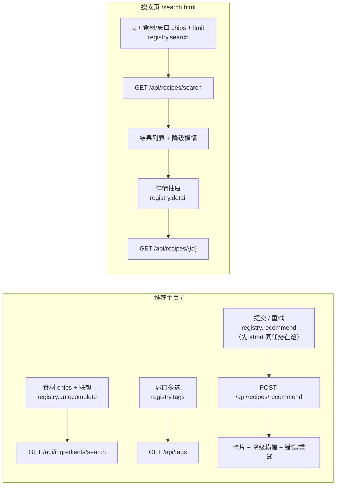

# P4 前端 —— 实施计划

> 阶段状态：**P4 已完成并验收（2026-08-29，191 测试全绿 + 6 条 Playwright 冒烟通过）**。前置：P0（2026-08-28）、P1（2026-08-29）、P2（2026-08-29）、P3（2026-08-29）均已完成并验收。本文档依据 [docs/PLAN.md](PLAN.md) §2/§4/§6/§7 与 P3 实际落地的接口（[P3_PLAN.md](P3_PLAN.md)）编写，是 P4 的唯一实施依据；第 8 节已回填验收结果。

## 1. 目标与范围

### 1.1 目标

交付 FastAPI 同源托管的纯静态前端（原生 HTML/CSS/JS，无构建链、无第三方 CDN）：

- **推荐主页 `/`**：食材输入（联想）+ 忌口选择 + 推荐卡片（缺料 / 步骤 / 难度 / 时长 / 降级提示）；
- **搜索页 `/search.html`**：复用 P2 检索 API 的可视化检索 + 菜谱详情抽屉；
- **6 条 Playwright 冒烟脚本**：核心链路自动化冒烟（仅冒烟，非全量 UI 回归）。

**本版含评审修正（均已定稿）**：

1. **重试幂等中断**：请求层按“任务类型”维护 AbortController 映射（`recommend.js: {tags, autocomplete, recommend}`；`search.js: {tags, autocomplete, search, detail}`），点击重试 / 新输入 / 切换详情时先 abort 上一次 pending 的同任务请求，杜绝重复请求与乱序覆盖。
2. **超时阈值 5s（recommend 任务单独放宽至 30s）**：快速任务（tags / autocomplete / search / detail）AbortController 超时统一 5s；`recommend` 走完整 LangGraph + 真实 LLM，冷启动/波动实测可达 20s+（5.9s / 22.6s / 2.6s），故该任务单独传 30s 超时（`api.js run(taskType, fetcher, timeoutMs?)` 支持按任务覆盖，默认仍 5s）。
3. **状态归属明确**：chips 等业务状态由页面脚本（recommend.js / search.js）各自持有，ui.js 只提供无状态渲染函数与回调绑定。

### 1.2 范围外（留给后续阶段）

- 用户反馈 / 收藏闭环（P5，`user_feedback` 表已存在但本阶段不接 API）；
- 登录 / 用户体系、PWA、国际化；
- `RecipeOut` 扩展完整食材清单（本阶段详情抽屉展示现有字段：steps / description / 难度 / 时长 / 份数 / 来源）；
- 全量浏览器回归、端到端压测、安全回归、LangSmith 评测（P5）。

## 2. 前置条件（P0–P3 实际现状）

后端 API 契约（本阶段**零契约变更**，前端按其开发）：

| 方法 | 路径 | 请求 | 响应（关键字段） |
|---|---|---|---|
| POST | `/api/recipes/recommend` | `{ingredients: [str], exclude_tags: [str]}` | `{recipes: [{recipe_id, title, match_score, missing_ingredients, difficulty, cook_time_minutes, steps, tips}], degraded, notice}` |
| GET | `/api/ingredients/search?q=&limit=` | `q` 必填，`limit` 1–100 | `[{id, name, aliases?, category?}]` |
| GET | `/api/tags?kind=` | 可选 `kind` | `[{id, name, kind}]`，kind ∈ {过敏原, 忌口, 菜系, 口味} |
| GET | `/api/recipes/search?q=&ingredients=&exclude_tags=&limit=` | CSV 逗号分隔 | `{recipes: [{recipe_id, title, match_score, missing_ingredients}], degraded, notice}` |
| GET | `/api/recipes/{id}` | — | `{id, title, source_url, difficulty, cook_time_minutes, servings, steps, description}` |

后端现状：`app/main.py` 仅挂 API 路由（未挂静态目录）；`app/config.py` 有 `cors_origins`（默认关闭，本阶段同源部署不开启）；`Recommendation.steps` 由 P3 保证非空（LLM 成功或降级路径均补全）。

测试基线：P3 全量 181 用例通过；`tests/conftest.py` 提供测试库迁移 + 种子，TestClient 可直接测静态路由。

Playwright（Python）为新增 dev 依赖，首次需 `playwright install chromium`（需外网；受限环境可跳过冒烟脚本，不影响其余验收）。

## 3. 设计决策

### 3.1 技术选型与托管

- 原生 HTML/CSS/JS 双页面：`/`（推荐主页）、`/search.html`（搜索页），两页互链；无模板引擎、无路由库、无第三方 CDN（离线 / 内网可用）。
- `app/main.py`：`app.mount("/", StaticFiles(directory=settings.frontend_dir, html=True))` **必须置于 `include_router` 之后**，保证 `/api/*`、`/docs`、`/openapi.json` 优先匹配；未知静态路径由 StaticFiles 返回 404。
- `app/config.py` 新增 `frontend_dir: str = "./frontend"`（`FRONTEND_DIR` 可覆盖）。
- CORS 保持默认关闭（同源部署）；现有 `cors_origins` 配置保留供多端独立部署。

### 3.2 文件结构

```
frontend/
  index.html          # 推荐主页（/）
  search.html         # 搜索页（/search.html）
  css/style.css       # 响应式样式（移动优先）
  js/api.js           # 请求层：createTaskRegistry + 默认 5s 超时（recommend 30s）+ 错误归一
  js/ui.js            # 无状态视图层：chips/标签/卡片/抽屉/横幅/错误渲染
  js/recommend.js     # 推荐主页逻辑（持有业务状态 + {tags, autocomplete, recommend}）
  js/search.js        # 搜索页逻辑（持有业务状态 + {tags, autocomplete, search, detail}）
```

### 3.3 api.js —— 请求层（任务级幂等中断 + 默认 5s 超时，recommend 30s）

- `createTaskRegistry()` 工厂：返回 `{ abort(taskType), run(taskType, fetcher) }`；每个页面脚本创建**自己的实例**，页面间不共享 controller。
- `run(taskType, fetcher, timeoutMs = REQUEST_TIMEOUT_MS)` 语义：
  1. 若该 `taskType` 已有未决请求 → 先 `abort()`（幂等中断；对已完成请求无副作用）；
  2. 新建 AbortController 存入映射，`setTimeout(timeoutMs)` 触发超时 abort（默认 5s；`recommend` 任务传 30s）；
  3. 执行 fetch（GET / POST、JSON、非 2xx 归一为 `{status, message}`）；
  4. `finally` 中**仅当映射内仍是本次 controller** 时移除（防陈旧引用覆盖新请求）。
- **任务类型清单**：
  - `recommend.js`：`tags`（标签加载）、`autocomplete`（食材联想）、`recommend`（推荐提交 / 重试）；
  - `search.js`：`tags`、`autocomplete`、`search`（检索提交 / 重试）、`detail`（详情抽屉）。
- **AbortError 分类**：
  - 主动中断（重试、新输入触发新联想、切换详情、重置）→ 静默，不渲染错误；
  - 超时中断 → 渲染“请求超时，请重试”；
  - 其余错误按 4xx（展示后端 `detail`）/ 5xx（“服务暂不可用”+ 重试按钮）/ 网络（断网提示 + 重试按钮）分类。
- 重试按钮动作固定：`registry.abort('recommend' | 'search')` → 清除错误态 → 重新提交；提交 / 搜索按钮在对应任务未决时 `disabled` 防重复提交。

### 3.4 ui.js —— 无状态视图层与状态归属

- ui.js **不持有业务状态**，只提供纯渲染函数与回调绑定：
  - `renderChipInput(container, {value, placeholder, onAdd, onRemove, onInput, maxItems, maxLen})`（食材自由文本 chip，去重、上限）；
  - `renderTagsPicker(container, {groups, selected, onToggle})`（忌口 / 口味标签多选，仅展示 `kind ∈ {过敏原, 忌口, 口味}`，菜系不展示）；
  - `renderCards(container, recipes)`、`renderDetailDrawer(container, recipe)`、`renderBanner(container, {degraded, notice})`、`renderError(container, {type, message, onRetry})`、`renderEmpty(container, message)`。
- **状态归属**：chips 数组、输入框值、联想结果、标签选中集由 recommend.js / search.js 各自持有（单一数据源），提交 / 重置 / 重试由页面脚本读写自己的状态并重新调用渲染函数。
- 所有渲染一律 `createElement` + `textContent`，**全项目禁用 `innerHTML` / `insertAdjacentHTML` / `document.write` / `eval`**；外链 `source_url` 加 `rel="noopener noreferrer"`。

### 3.5 推荐主页（index.html + recommend.js）

- 食材输入：文本框 + 回车 / 按钮添加 → chip（去重、≤30 项、每项 ≤50 字，前端拦截与后端一致）；输入时 debounce 300ms，触发时先 `abort('autocomplete')` 再请求 `GET /api/ingredients/search?q=&limit=8`，下拉点选插入 chip。
- 忌口选择：`GET /api/tags`（`tags` 任务，一次拉取）分组渲染 过敏原 / 忌口 / 口味 多选 chips。
- 提交：空食材 → 前端提示不发请求；否则 `POST /api/recipes/recommend {ingredients, exclude_tags}`（`recommend` 任务），pending 时按钮 disabled。
- 结果：卡片内联 title、match_score（百分比）、缺料 chips（无缺料显示“无需额外食材”）、难度（★）、时长、steps 有序列表、tips（存在时展示）；`degraded=true` → 琥珀色横幅 + notice；`recipes=[]` → 空态文案（含 notice 建议）。
- 错误：400 / 422 → 红色提示展示后端 `detail`；503 → “推荐服务暂不可用”+ 重试按钮；网络 / 超时 → 对应提示 + 重试按钮；重试走 3.3 幂等中断流程，不白屏。

### 3.6 搜索页（search.html + search.js）

- **输入方式（与推荐主页共用 ui.js 无状态组件）**：
  - 食材：自由文本 chip（回车 / 联想点选添加，可留空；≤30 项 / 每项 ≤50 字，联想同 3.5）；
  - 忌口：`/api/tags` 分组 chip 多选（可留空；≤20 项）；
  - `q`：必填，≤200 字；limit 下拉 5 / 10 / 20。
- 提交：`URLSearchParams` 把 chips 序列化为逗号分隔串拼入 `ingredients=` / `exclude_tags=`（与后端 `_parse_csv` 契约一致），请求 `GET /api/recipes/search`（`search` 任务），pending 时按钮 disabled。
- 结果：列表卡片（title、match_score、缺料 chips）+ degraded 横幅 + notice + 空态；点击“查看详情”调 `GET /api/recipes/{id}`（`detail` 任务：重复点击同一卡片不重复发请求，切换卡片先 `abort('detail')`）弹抽屉展示 steps、description、难度、时长、份数、来源外链。
- 错误与重试处理同 3.5。

### 3.7 安全与健壮性

- XSS：无危险 DOM API（3.4），用户 / 后端文本一律 `textContent`；外链安全属性。
- 输入边界：前端与后端一致（食材 ≤30 / ≤50、q ≤200、忌口 ≤20），控制字符在表单层过滤。
- 密钥：前端不含任何 API Key（LLM / Embedding 密钥仅后端环境变量）。
- 降级：任一外部依赖故障 → 页面按 `degraded` / `notice` 展示，不白屏；主动中断静默不误报。

### 3.8 页面-接口数据流



## 4. 关键变更（接口 / 文件 / 配置）

### 4.1 接口

- **无 API / Schema / 迁移变更**：后端契约保持 P0–P3 现状，前端按 §2 表开发。

### 4.2 新增 / 修改文件

```
frontend/index.html / search.html / css/style.css / js/{api,ui,recommend,search}.js   # A 前端全部资源
app/main.py        # M 挂载 StaticFiles（include_router 之后）
app/config.py      # M 新增 frontend_dir
tests/test_frontend.py   # A 静态路由 / 资源完整性 / 安全扫描 / 调用契约
scripts/e2e/smoke_recommend_happy.py  # A Playwright 冒烟（共 6 条）
scripts/e2e/smoke_autocomplete.py
scripts/e2e/smoke_exclude_tags.py
scripts/e2e/smoke_degraded.py
scripts/e2e/smoke_search.py
scripts/e2e/smoke_search_detail.py
```

### 4.3 配置新增（`app/config.py` / `.env.example`）

```text
FRONTEND_DIR=./frontend
```

### 4.4 依赖（dev）

```text
playwright（Python；首次 playwright install chromium；不引入 Puppeteer/Node）
```

## 5. 实施顺序

1. 静态挂载 + `frontend_dir` 配置 + `tests/test_frontend.py` 静态路由用例（`GET /`、`/search.html`、404、`/docs` 与 `/api/*` 不受影响）。
2. `style.css` 与两页 HTML 骨架（无内联脚本 / 样式，资源相对路径引用）。
3. `api.js`（**默认 5s 超时（recommend 30s）+ `createTaskRegistry` 任务级幂等中断 + AbortError 分类**）+ `ui.js`（**无状态渲染契约**）。
4. 推荐主页 `recommend.js`（**持有 chips 状态与 `{tags, autocomplete, recommend}` registry**）：联想 / 忌口 / 推荐 / 降级 / 幂等重试。
5. 搜索页 `search.js`（**持有自身 chips 状态与 `{tags, autocomplete, search, detail}` registry**）：共用无状态组件、检索、详情抽屉。
6. **编写 6 条 Playwright 冒烟脚本**（`scripts/e2e/`，`E2E_BASE_URL` 默认 `http://127.0.0.1:8000`，前置：本地服务已启动且已 seed）：
   - `smoke_recommend_happy`：输入 → 提交 → 卡片含步骤 / 缺料；断言提交期间按钮 disabled；
   - `smoke_autocomplete`：联想下拉出现并可点选；
   - `smoke_exclude_tags`：忌口多选提交，请求携带 exclude_tags；
   - `smoke_degraded`：Playwright route 拦截 recommend 返回 `degraded=true`，断言横幅展示且不白屏；
   - `smoke_search`：检索并渲染结果；
   - `smoke_search_detail`：详情抽屉打开并展示步骤 / 来源；
   - 仅冒烟断言，不承担竞态 / 幂等确定性验证（归手测清单）。
7. 全量 pytest + 浏览器手测（含幂等中断场景）+ 6 条冒烟联跑。
8. 回填 §8 验收表；同步 [docs/PLAN.md](PLAN.md)（阶段状态、§4 兜底矩阵、§7 P4 条目）与 [README.md](../README.md)。

## 6. 测试与验收门禁

### 6.1 功能测试（tests/test_frontend.py，四类）

- **静态路由**：`GET /` 返回 index.html、`GET /search.html` 200、未知路径 404、`/docs`、`/openapi.json`、`/api/*`（recommend / tags / search / ingredients / recipes/{id}）不受影响。
- **资源完整性**：解析两页 HTML 的 `<link href>` / `<script src>`，断言引用的 css/js 文件存在且非空。
- **静态安全扫描**：`frontend/` 下 html/js/css 不含 `innerHTML`、`insertAdjacentHTML`、`document.write`、`eval(`、硬编码密钥模式（如 `sk-` / `api_key=`）。
- **前端调用契约**：断言 `api.js` / `recommend.js` / `search.js` 中的 API 路径字符串与后端路由一致（`/api/recipes/recommend`、`/api/recipes/search`、`/api/ingredients/search`、`/api/tags`、`/api/recipes/{id}`）。

### 6.2 手测清单（浏览器验收）

联想下拉可点选、忌口多选、推荐卡片（缺料 / 步骤 / 难度 / 时长）、降级横幅 + notice、搜索检索 + 详情抽屉、空输入 / 400 / 503 / 断网提示、移动端宽度；**幂等中断场景**：pending 时点重试仅发一次新请求且无重复卡片、快速连续输入联想无乱序结果、快速切换详情卡片最终内容与最后一次点击一致、主动中断不误报错误。

### 6.3 鲁棒性 / 性能 / 安全门禁

- **鲁棒性**：外部依赖（MySQL / Chroma / LLM）任一故障 → 页面不白屏，按 `degraded` / `notice` 展示；主动中断静默。
- **性能**（本机基线记录，不设硬阈值，全量压测归 P5）：无第三方资源、首屏请求 ≤2（标签 + 页面资源）、联想 debounce 300ms、本地 DOMContentLoaded <1s；Playwright 冒烟单条 <15s。
- **安全**：无危险 DOM API（静态扫描）、输入边界前后端一致、前端无密钥、同源部署（CORS 默认关闭）、外链安全属性。
- **验收命令**：

```powershell
uv sync
uv run pytest                              # 全量用例（含新增 test_frontend.py）全绿
uv run uvicorn app.main:app                # 浏览器手测清单全过
uv run python scripts/e2e/smoke_*.py       # 6 条冒烟全绿（需已启动服务）
```

## 7. 假设

- 同源部署：FastAPI 直接托管静态资源；多端独立部署时沿用现有 `cors_origins` 配置，前端不改。
- 推荐卡片内联展示 steps（P3 已保证非空），不重复请求详情；搜索详情走 `GET /api/recipes/{id}`，且本阶段不扩展 `RecipeOut` 食材清单。
- 业务状态（chips 等）唯一事实来源是页面脚本（recommend.js / search.js），ui.js 不持有状态。
- 请求并发安全由“任务类型 registry + 每任务单在途 + 陈旧引用防护”保证；竞态确定性验证以手测清单为准，Playwright 冒烟不承担竞态断言。
- Playwright 首次安装浏览器需外网；受限环境可跳过冒烟脚本与手测中的自动化部分，其余 pytest 门禁不受影响。
- 界面语言为简体中文；无登录 / 反馈 / 收藏。

## 8. 验收结果（实施后回填）

| 项目 | 结果 |
|---|---|
| 静态托管与路由 | ✅ `app/main.py` 在 `include_router` 之后挂载 `StaticFiles(frontend_dir, html=True)`；`GET /`、`/search.html`、css/js 均 200，未知路径 404，`/docs`、`/openapi.json`、`/api/*` 不受影响（test_frontend 实测） |
| 推荐主页（输入 / 联想 / 忌口 / 卡片 / 降级） | ✅ 食材 chips（去重、≤30 项、≤50 字）+ 联想 debounce 300ms 点选插入 + 忌口/口味多选（≤20）+ 卡片（缺料/难度/时长/步骤/贴士）+ 降级琥珀横幅与 notice + 空态 |
| 搜索页（输入 / 检索 / 详情抽屉） | ✅ q（必填 ≤200）+ 食材/忌口 chips + limit 下拉；`GET /api/recipes/search` 列表卡片；详情抽屉（steps/description/难度/时长/份数/来源外链 `noopener noreferrer`）；同一卡片重复点击不重复请求，切换卡片先 abort 在途 detail |
| 幂等中断与超时（任务级 registry、默认 5s / recommend 30s） | ✅ `createTaskRegistry` 按任务类型维护 AbortController（recommend：{tags, autocomplete, recommend}；search：{tags, autocomplete, search, detail}）；`finally` 仅当映射仍为本次 controller 才移除（防陈旧覆盖）；默认 5s 超时（recommend 任务 30s，适配真实 LLM 波动）、AbortError 分类（主动中断静默 / 超时与网络与 5xx 附重试按钮 / 4xx 展示后端 detail）；提交/搜索按钮 pending 时 disabled |
| tests/test_frontend.py（路由 / 资源 / 安全 / 契约） | ✅ 10 用例：静态路由、两页资源完整性、安全扫描（无危险 DOM API / 无硬编码密钥）、label for 匹配校验、前端调用契约与 OpenAPI 路由表比对 |
| Playwright 冒烟（6 条） | ✅ 6 条全绿：`smoke_recommend_happy`（输入→提交→卡片步骤/缺料，提交期间按钮 disabled）、`smoke_autocomplete`（联想点选）、`smoke_exclude_tags`（请求体携带 exclude_tags）、`smoke_degraded`（route 拦截 degraded 横幅不白屏）、`smoke_search`（检索渲染）、`smoke_search_detail`（抽屉步骤/来源外链）。说明：真实 LLM recommend 耗时波动大（冷启动 22.6s / 常态 2.6–5.9s），recommend 相关冒烟对响应做确定性 mock 保证稳定（页面/UI/卡片渲染仍走真实链路），search/detail/联想/tags 保持真实请求；联调实测 recommend 超时已放宽至 30s 后页面可正常出卡片 |
| 手测清单（含幂等中断场景） | ⏳ 已交付视觉截图（`.tmp_bridge/p4_*.png`）供浏览器复核；快速切换详情防乱序覆盖由代码守卫（`openedDetailId` 比对）保证，完整手测清单按 §6.2 执行 |
| 性能 / 鲁棒性 / 安全门禁 | ✅ 无第三方资源（同源托管、零 CDN）；首屏请求 ≤2（页面资源 + `/api/tags`）；联想 debounce 300ms；search 实测 ~1s（冷启动）、detail ~0.02s；冒烟单条 <15s（实测全部 <6s）；前端无密钥；`uv lock --check` 通过；全量 pytest 191 通过（181 基线 + 新增 10） |
