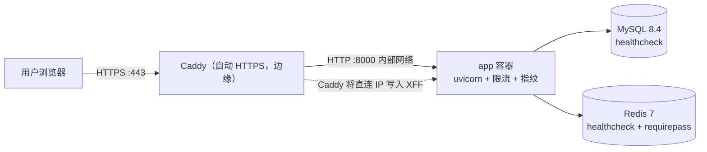
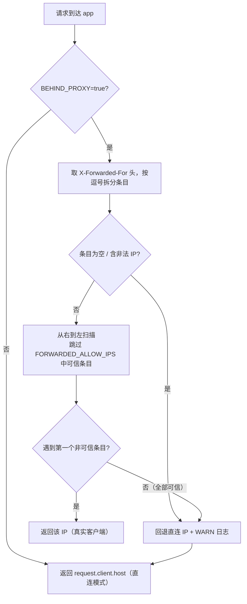

# P6 部署上线 —— 实施计划

> 阶段状态：**P6 代码实施完成 + 本机裸机验证（2026-08-29；269 passed + 13 skipped）；
> Docker 全栈服务器实跑与 CI 实跑待回填 §8**。前置：P0–P5 均已完成并验收
> （240 测试全绿 + 6 条 Playwright 冒烟 + k6 10k 门禁 + 50k 留痕，基线见 §2）。
> 本文档依据 [docs/PLAN.md](PLAN.md) §6/§7、P5 部署须知（[docs/P5_PLAN.md](P5_PLAN.md) §9）
> 及公网部署审计结论编写，是 P6 的唯一实施依据；验收结果实施后回填 §8。

## 1. 目标与范围

### 1.1 目标

- **Docker Compose 全栈部署**：app + MySQL + Redis + Caddy 自动 HTTPS，一条命令拉起；
  受限环境采用“方式 B 裸机验证 + 服务器实跑”双轨留痕（不可因本机无法跑 Docker 而跳过验收）。
- **公网鉴权形态**：匿名 + 限流（已确认：不引入登录 / API Key）；限流与反馈指纹在反代
  拓扑下仍能识别真实客户端 IP。
- **反代可信链路**：Caddy 为唯一入口；`BEHIND_PROXY` + `FORWARDED_ALLOW_IPS` 明确可信代理，
  `get_client_ip()` 按“X-Forwarded-For 右起第一个非可信条目”解析，slowapi 与反馈指纹共用。
- **安全加固**：`DOCS_ENABLED=false` 关闭 /docs、`ALLOWED_HOSTS` + TrustedHostMiddleware、
  安全响应头（CSP / X-Frame-Options / X-Content-Type-Options / Referrer-Policy）、
  compose 凭据全走 .env 强口令、`start.sh` 增加反代校验盲区兜底。
- **最小运维**：无锁备份（`backup.sh`，`--stop-app` 绑定可接受停机窗口）、
  就绪探针（/health/live + /health/ready）、结构化日志落 stdout。
- **CI 门禁**：GitHub Actions 跑 pytest + 6 条 Playwright 冒烟 + k6 10k 门禁；
  `rate_limit.js` 在限流开启实例单独跑；50k 沿用 P5 §8 留痕，不在 CI 重复。

### 1.2 范围外（留给后续阶段）

- 登录 / 用户体系 / API Key 鉴权（P6 已确认匿名 + 限流）；
- Prometheus / Grafana 监控告警、SLO 面板；
- CDN / 多级代理 / 负载均衡（本方案为单机单入口，多级代理沿用右到左算法扩展）；
- Kubernetes / 弹性伸缩；
- 采集任务容器化（采集仍走脚本，不入 compose 常驻服务）。

## 2. 前置条件（P0–P5 实际现状）

- 后端 API：`POST /api/recipes/recommend`、`GET /api/ingredients/search`、
  `GET /api/recipes/search`、`GET /api/recipes/{id}`、`GET /api/tags`、
  `POST /api/feedback`，全部完成并验收。
- 限流：slowapi 已集成（recommend 10/min、feedback 20/min、其余 100/min、429 友好 JSON）；
  `RATE_LIMIT_STORAGE=redis` 必填 URL（config 校验）；lifespan Redis `ping()` fail-fast。
- 生产入口：`scripts/start.sh` 已强校验 `FEEDBACK_SALT` / Redis（P5）；**尚无** `BEHIND_PROXY` 校验。
- IP 识别现状：`get_remote_address`（slowapi）与 `client_fingerprint` 均取 `request.client.host`，
  直连模式正确，**反代后会把所有用户识别为 Caddy 容器 IP**（P6 修复点）。
- 部署现状：仅 `docker-compose.yml`（MySQL 单服务）；无应用镜像、无 Caddy、无 CI；
  `start.sh` 裸 HTTP `0.0.0.0:8000`，无 Host 校验，/docs 默认开放。
- 测试基线：`uv run pytest` = 240 passed + 5 skipped（start.sh bash 用例本机跳过）；
  6 条 Playwright 冒烟全绿；k6 10k 门禁通过 + 50k 留痕（P5 §8）。
- 依赖：`redis>=8.1.0` 已在主依赖；无新增 pip 依赖预期（CI/部署用外部工具 docker / k6）。

## 3. 设计决策

### 3.1 部署形态：Docker Compose 全栈 + 双轨留痕



- 服务组成：`mysql`（8.4）、`redis`（7-alpine，requirepass）、`app`（自建镜像）、
  `caddy`（2-alpine，固定容器 IP 172.28.0.10）。
- 自定义网络 `ai_cooker_net`（子网 172.28.0.0/16）：生产 **MySQL / Redis / app 不映射宿主端口**，
  仅 Caddy 暴露 80/443；本机调试需直连时再显式映射（文档注明，默认关闭）。
- 受限环境验收双轨：本机仅能做“裸机验证”（现有 MySQL 直跑 uvicorn + 配置项单测）时，
  必须在服务器 / 预发布环境实跑 Docker 全栈并回填 §8，二者不可互相替代。

### 3.2 就绪门控（`depends_on` 只保证“已启动”，不保证“可接受连接”）

- `app` 的 `depends_on` 使用 `condition: service_healthy`：
  - `mysql` healthcheck：`mysqladmin ping`（已有，interval 5s / timeout 5s / retries 30）；
  - `redis` healthcheck：`redis-cli -a $REDIS_PASSWORD ping`。
- 入口脚本 `scripts/docker-entrypoint.sh`（app 容器 ENTRYPOINT）：
  1. **MySQL 就绪重试**：用项目内 Python（pymysql）执行 `SELECT 1`，30 次 × 2s，
     全部失败 → `exit 1`（打印最后错误，容器退出便于编排发现）；
  2. **`alembic upgrade head`**：迁移成功才继续（幂等，重复启动不重复建表）；
  3. **`exec uvicorn`**：替换 shell 进程，信号直通容器。
- 失败语义：任一环节失败容器退出并 `restart: unless-stopped` 由编排重启；
  首启时 MySQL 尚未初始化完成也不会出现“应用已启动但迁移失败”的竞态。

### 3.3 可信代理与真实客户端 IP（限流 / 指纹共用）

**不依赖 uvicorn `--proxy-headers`**（避免信任任意上游头）；应用自持解析：

- 新增配置：`BEHIND_PROXY`（bool，默认 false）、`FORWARDED_ALLOW_IPS`
  （逗号分隔 IP / CIDR，如 `172.28.0.10` 或 `172.28.0.0/16`）。
- `app/core/rate_limit.py` 新增 `get_client_ip(request) -> str`：



- 语义：XFF 形如 `客户端, 代理1, 代理2, …`，最右为离服务器最近的代理追加；
  右起第一个非可信条目即真实客户端 IP。XFF 缺失 / 全可信 / 非法 → 回退直连 IP 并 WARN
  （此时是内部代理访问或直连攻击，按代理 IP 限流，不静默放过）。
- slowapi 的 `key_func` 从 `get_remote_address` 改为 `get_client_ip`；
  `app/api/routes/feedback.py` 的 `client_fingerprint` 同样改用 `get_client_ip`，
  保证“限流桶”与“反馈指纹”基于同一个 IP 语义。
- `scripts/start.sh` 新增校验：`BEHIND_PROXY=true` 且 `FORWARDED_ALLOW_IPS` 为空 →
  `exit 1`（反代后误用直连计数 = 所有用户共享一个桶，限流形同虚设，拒绝启动而非 WARN）。

### 3.4 Caddy 边缘与 XFF 行为（已按官方文档核实）

- Caddy 以**边缘模式**运行，**不配置 `trusted_proxies`**：
  官方行为是“未配置时 Caddy 用其直连 IP 设置 / 重写 X-Forwarded-For，
  客户端伪造的 XFF 值被丢弃；配置了 `trusted_proxies` 后才信任并追加上游 XFF”。
  因此 app 收到的 XFF 只有 Caddy 写入的一项（真实客户端 IP），无需防“客户端伪造多级”。
- `FORWARDED_ALLOW_IPS` 只包含 Caddy 容器 IP（`172.28.0.10`，compose 自定义网络固定，
  避免重启后 IP 漂移）。即使将来换 CDN / 多级代理，右到左算法不变，仅需扩充白名单。
- Caddyfile：`your-domain.com { reverse_proxy app:8000 }`，自动 HTTPS（HTTP-01）；
  http 请求由 Caddy 默认 308 跳转 https。安全响应头统一由 app 中间件输出
  （直连 app 端口也有保护），Caddy 不重复设置。

### 3.5 安全加固

- `DOCS_ENABLED=false`（默认 true 保持开发习惯；生产显式 false）→
  `FastAPI(docs_url=None, openapi_url=None)`，`/docs`、`/openapi.json` 404。
- `ALLOWED_HOSTS`（逗号分隔，空 = 不校验）→ `TrustedHostMiddleware`，
  Host 头不匹配返回 400，防 Host 头注入 / 缓存投毒。
- 安全响应头中间件：`Content-Security-Policy`（`default-src 'self'`，
  具体指令按前端静态扫描结果校准：同源脚本 / 样式，禁止外部域）、
  `X-Frame-Options: DENY`、`X-Content-Type-Options: nosniff`、
  `Referrer-Policy: no-referrer`。
- compose 凭据全走 `.env`：`MYSQL_ROOT_PASSWORD` / `MYSQL_PASSWORD` / `REDIS_PASSWORD`
  必须为强口令（compose 内不再出现 `ai_cooker` / `ai_cooker_root` 等默认弱口令）；
  `.env` 已 gitignore，CI 用 secrets 注入。
- 沿用 P5：`FEEDBACK_SALT` 生产强校验、限流 Redis fail-fast、CORS 默认关闭、
  SQL / Prompt 注入 / XSS 回归门禁；`uv audit` 沿用 chromadb 已知漏洞记录。

### 3.6 备份与恢复（无锁 + Chroma 以重建为准）

`scripts/backup.sh`：

- **MySQL 无锁备份**：`mysqldump --single-transaction --set-gtid-purged=OFF --routines --triggers`
  （InnoDB 一致性快照，不锁表；反馈表高并发写入不阻塞），输出 gzip 至 `BACKUP_DIR`。
- **Chroma 目录**：tar `data/chroma`；**明确非强一致**（打包与写入并发可能产生不一致快照），
  恢复时**以 MySQL + ingest 重建为准**：`alembic upgrade head` → 迁移校验 → 重新
  `crawl_recipes.py --stage ingest` 重建向量，不回放 Chroma tar 作为唯一恢复手段。
- `.env` 属敏感配置：备份清单单独提示（不并入公开备份文件；由运维按密码管理流程处理）。
- `--dry-run`：只打印将执行的命令与目标路径，无副作用。
- `--stop-app` 模式：**必须绑定可接受停机窗口**——执行前校验环境变量
  `BACKUP_STOP_APP_ALLOWED=true`（未设置直接拒绝），流程为：
  记录开始时间 → `docker compose stop app` → 备份（MySQL + Chroma）→
  `docker compose start app` → 轮询 `/health/ready` 200（30 次 × 2s）→
  输出停机起止时长并写入备份清单；任何一步失败即恢复 app 并打印错误（不静默退出 0）。
- 恢复演练纳入验收（§6.2）：备份 → 清库 → 回放 → `/health/ready` 200 + 菜谱行数一致。

### 3.7 最小运维（探针 / 日志 / 重启策略）

- 探针：`/health/live`（恒 200）与 `/health/ready`（DB + Chroma，故障 503）已具备，
  compose healthcheck 与 backup 轮询直接复用；Caddy 不额外做健康路由。
- 日志：`app/core/logging.py` 结构化日志已具备，容器内落 stdout，
  由 `docker compose logs -f app` 收集；日志事件带 `ingest.*` / `feedback.created` 等类型。
- 重启策略：`restart: unless-stopped`；app 依赖的 MySQL / Redis 也同策略。

### 3.8 CI 门禁（GitHub Actions）

`.github/workflows/ci.yml`（单 job，串行门禁）：

1. uv setup + Python 3.14 + `uv sync --frozen`；
2. services.mysql（`mysql:8.4`，健康检查）→ `alembic upgrade head` →
   `seed_dictionary.py` → `seed_synthetic_recipes.py --count 10000`；
3. `uv run pytest`（全部单测 / 回归，含 P6 新增 IP 解析、安全加固用例）；
4. 启动服务（`LLM_MOCK=true`、`RATE_LIMIT_ENABLED=false`、`EMBEDDING_API_KEY` 空）
   → 6 条 Playwright 冒烟（`E2E_BASE_URL=http://127.0.0.1:8000`）；
5. k6 10k 门禁：`search / detail / ingredients / tags / recommend_mock / feedback`
   阈值沿用 P5（内置脚本 thresholds），`--summary-export` 留 JSON；
6. `rate_limit.js`：**单独实例**以 `RATE_LIMIT_ENABLED=true` +
   `RATE_LIMIT_STORAGE=memory` 启动后执行（不污染主压测实例测量）；
7. 50k 档**不在 CI 重复**（沿用 P5 §8 留痕，CI 时间预算有限）。

## 4. 关键变更（接口 / 文件 / 配置 / 依赖）

### 4.1 接口

- **零 API 变更**（向后兼容）；仅 `/docs`、`/openapi.json` 在 `DOCS_ENABLED=false` 时 404
  （配置开关，非接口破坏）。

### 4.2 新增 / 修改文件

```
Dockerfile                          # A 应用镜像：python:3.14-slim + uv --frozen --no-dev + 代码/迁移/前端
docker-compose.yml                  # M 全栈：mysql + redis + app + caddy；自定义网络固定 Caddy IP；
                                    #   生产不映射 MySQL/Redis 宿主端口；凭据全部走 .env
Caddyfile                           # A 自动 HTTPS 反向代理（边缘模式，不配 trusted_proxies）
scripts/docker-entrypoint.sh        # A 就绪等待（SELECT 1 30×2s）→ alembic upgrade head → exec uvicorn
scripts/backup.sh                   # A 无锁备份 + Chroma tar + --dry-run + --stop-app（停机窗口门禁）
.github/workflows/ci.yml            # A GitHub Actions 门禁（§3.8）
app/config.py                       # M BEHIND_PROXY / FORWARDED_ALLOW_IPS / DOCS_ENABLED /
                                    #   ALLOWED_HOSTS / SECURITY_HEADERS_ENABLED + 校验
app/core/rate_limit.py              # M get_client_ip() 右到左算法；slowapi key_func 复用
app/api/routes/feedback.py          # M client_fingerprint 改用 get_client_ip()
app/main.py                         # M TrustedHostMiddleware / 安全响应头 / docs 开关
scripts/start.sh                    # M BEHIND_PROXY=true 且 FORWARDED_ALLOW_IPS 空 → exit 1
.env.example                        # M 新增 P6 部署配置模板（强口令占位说明）
docs/P6_PLAN.md                     # A 本文档
docs/PLAN.md / README.md            # M 阶段状态同步
tests/                              # A/M 见 §6.1
```

### 4.3 配置新增（app/config.py / .env.example）

```text
# P6 部署（生产）
BEHIND_PROXY=true                    # 经 Caddy 反代必须 true；false 时按直连 IP 计数
FORWARDED_ALLOW_IPS=172.28.0.10     # 可信代理 IP/CIDR（逗号分隔）；须与 Caddy 容器 IP 一致
ALLOWED_HOSTS=your-domain.com       # Host 白名单（逗号分隔；空=不校验，生产必填）
DOCS_ENABLED=false                  # false → /docs、/openapi.json 404（生产建议 false）
SECURITY_HEADERS_ENABLED=true       # CSP / X-Frame-Options / nosniff / Referrer-Policy

# Docker 全栈（compose 使用；强口令仅存 .env，禁止入库）
MYSQL_DATABASE=ai_cooker
MYSQL_USER=ai_cooker
MYSQL_PASSWORD=<强口令>
MYSQL_ROOT_PASSWORD=<强口令>
REDIS_PASSWORD=<强口令>
CADDY_DOMAIN=your-domain.com
BACKUP_DIR=./backups
```

### 4.4 依赖

- pip：**无新增**（redis / slowapi 已入主依赖）。
- 外部：Docker Compose v2、k6（CI 安装或 `docker run --rm -i grafana/k6` 兜底）。

## 5. 实施顺序

1. **IP 解析与配置**：`app/config.py`（BEHIND_PROXY / FORWARDED_ALLOW_IPS 等）→
   `get_client_ip()` 右到左算法 + 回退 WARN → slowapi key_func 与反馈指纹统一 →
   单测（含 CIDR、伪造多级、全可信、非法 XFF）。
2. **start.sh 反代校验**：`BEHIND_PROXY=true` + `FORWARDED_ALLOW_IPS` 空 → exit 1；
   子进程用例（bash 可用环境）与部署须知同步。
3. **应用安全加固**：`main.py` TrustedHost / 安全响应头 / docs 开关 + 对应回归用例。
4. **容器化**：Dockerfile → `docker-entrypoint.sh`（就绪等待 + 迁移 + exec）→
   全栈 compose（固定网络 / Caddy IP / healthcheck / 凭据 .env）→ Caddyfile。
5. **备份与恢复**：`backup.sh`（--dry-run / --stop-app 停机窗口门禁）→ 恢复演练脚本与记录。
6. **CI**：`.github/workflows/ci.yml`（§3.8 六步）→ 仓库推送试跑全绿。
7. **验收与收尾**：服务器实跑全栈（或受限环境双轨留痕）→ 回填 §8 →
   同步 docs/PLAN.md 与 README.md 为“已完成”。

## 6. 测试与验收门禁

### 6.1 功能测试（pytest 新增用例）

- `get_client_ip`：
  - `BEHIND_PROXY=false` → 返回直连 IP；
  - XFF=`1.2.3.4`、可信列表含 Caddy IP → 返回 `1.2.3.4`；
  - XFF=`1.2.3.4, 172.28.0.10`（客户端伪造多级）→ 右起第一个非可信 = `1.2.3.4`；
  - XFF 全部为可信条目 / 缺失 / 含非法 IP → 回退直连 IP 且产生 WARN 日志；
  - 白名单支持 CIDR（`172.28.0.0/16`）。
- 一致性：feedback 指纹与限流桶基于同一 IP 解析（同 IP 同指纹、同桶）。
- start.sh：`BEHIND_PROXY=true` 且 `FORWARDED_ALLOW_IPS` 空 → exit 1；
  `BEHIND_PROXY=false` → 不强制（bash 可用环境跑子进程用例，否则沿用 P5 跳过留痕）。
- main.py：`DOCS_ENABLED=false` → `/docs`、`/openapi.json` 404；Host 不匹配 → 400；
  安全响应头存在且取值正确；`DOCS_ENABLED=true` 恢复（开发模式回归）。
- docker-entrypoint：mock `SELECT 1` 失败 30 次 → exit 1；成功 → 执行迁移 → exec uvicorn
  （单测覆盖逻辑，不依赖真实 Docker）。
- backup.sh：`--dry-run` 无副作用；`--stop-app` 未设 `BACKUP_STOP_APP_ALLOWED` → 拒绝；
  备份文件名含时间戳、清单含起止时长（bash 可用环境跑）。

### 6.2 部署与生命周期验收（服务器实跑；受限环境双轨留痕）

- 首次部署：`docker compose up -d --build` → entrypoint 等待 MySQL 就绪 →
  自动 `alembic upgrade head` → app 正常启动 → `/health/live` 200、`/health/ready` 200。
- 幂等：重复 `docker compose up -d` / 重启 app 容器，迁移 0 变更、数据不重复。
- HTTPS：`https://your-domain.com` 200；`http://` 308 跳转；证书自动签发成功。
- 限流端到端：连续请求触发 429；多 IP 测试确认限流按真实客户端 IP 分桶
  （日志 / Redis 键验证，直连 Caddy 与伪造 XFF 均不可干扰计数）。
- 备份恢复演练：`backup.sh --stop-app` 输出停机起止时长 → 清库回放 →
  `/health/ready` 200 + `SELECT COUNT(*)` 与备份前一致 + Chroma 经 ingest 重建一致。
- CI：GitHub Actions 全绿（§3.8 六步）。

### 6.3 安全回归清单

- XFF 伪造：绕过 Caddy 直连 app（容器网络内）伪造 XFF → 计数按直连 IP 回退，不信任伪造值。
- Host 头注入：非白名单 Host → 400；重放攻击面收窄。
- 信息泄露：生产 `/docs`、`/openapi.json` 404；错误响应不泄漏堆栈。
- 响应头：CSP / X-Frame-Options DENY / nosniff / Referrer-Policy 实测存在。
- 凭据：compose 无明文口令；`.env` 不入库；`uv audit` 沿用 P5 chromadb 已知漏洞记录。
- 延续 P5：FEEDBACK_SALT 强校验、Redis fail-fast、SQL / Prompt 注入 / XSS 回归复跑。

### 6.4 验收命令

```powershell
# 受限环境（本机裸机验证）
uv sync
uv run pytest
uv run uvicorn app.main:app --host 127.0.0.1 --port 8000
# 服务器 / 预发布（Docker 全栈实跑）
docker compose up -d --build
docker compose ps
curl -s https://your-domain.com/health/live
curl -s https://your-domain.com/health/ready
# 备份演练
./scripts/backup.sh --dry-run
BACKUP_STOP_APP_ALLOWED=true ./scripts/backup.sh --stop-app
# CI 由 GitHub Actions 自动执行（pytest + 6 冒烟 + k6 10k + rate_limit 单独实例）
```

## 7. 假设

- 单机部署、Docker Compose v2；域名已解析到公网 IP，80/443 出方向可达（HTTP-01 签发证书）。
- 匿名 + 限流已确认，不引入登录 / API Key；无 Prometheus / Grafana。
- Caddy 是唯一入口（无 CDN）；多级代理扩展仅需扩充 `FORWARDED_ALLOW_IPS`，算法不变。
- app 单实例（1 worker）；多实例部署需外置 Redis 限流（能力已具备，compose 已含 Redis）。
- `FORWARDED_ALLOW_IPS` 须与 Caddy 容器实际 IP 一致（compose 自定义网络固定 172.28.0.10）；
  若运维调整网络，须同步更新配置，否则回退直连 IP 并 WARN（不静默）。
- 受限环境无法跑 Docker 时采用“裸机验证 + 服务器实跑”双轨，均须在 §8 留痕；
  无服务器实跑记录视为 P6 部署验收未通过（可留痕于受限环境外执行）。
- Chroma 备份非强一致，恢复以 MySQL + ingest 重建为准；`--stop-app` 停机窗口
  由运维显式声明（`BACKUP_STOP_APP_ALLOWED=true`），未声明拒绝执行。

## 8. 验收结果（实施后回填）

> 验收时间：2026-08-29（代码实施 + 本机裸机验证）；环境：Windows 11 教育版
> 10.0.26200 / i7-13700H（14C/20T）/ RAM 15.7GB / Python 3.14 + uv /
> MySQL 8.0.29；Docker 29.4.3 + Compose v5.1.3 已安装，但本机 daemon 未运行
> （受限环境，无 Docker 守护进程）。
>
> 双轨说明：受限环境无法实跑 Docker 全栈，按 §3.1/§7 完成“裸机验证 + 配置/静态
> 契约 + 单测”；服务器 / 预发布的 Docker 全栈实跑（compose up → Caddy HTTPS →
> 限流端到端 → 备份恢复演练）与 CI 实跑待回填，二者不可互相替代；无服务器实跑
> 记录视为 Docker 部署验收待完成（可留痕于受限环境外执行）。

| 项目 | 结果 |
|---|---|
| 全栈 compose（mysql/redis/app/caddy）启动与首启迁移 | ⏳ 待服务器实跑；本机 `docker compose config` 解析通过（自定义网络 172.28.0.0/16、Caddy 固定 172.28.0.10、凭据 `${VAR:?}` 强校验、app 绑定挂载 data/） |
| 就绪门控（service_healthy + entrypoint SELECT 1 30×2s） | ✅ 本机验证：`scripts/wait_for_mysql.py` mock 成功/失败/恢复单测通过；entrypoint 四阶段契约（预检→就绪→迁移→exec）断言通过；bash 全链用例本机跳过（WSL E_ACCESSDENIED），CI ubuntu 实跑 |
| Caddy 自动 HTTPS / 308 跳转 / 固定容器 IP | ⏳ 待服务器实跑（需域名 A 记录 + 80/443 出方向）；Caddyfile 边缘模式（不配 trusted_proxies）+ FORWARDED_ALLOW_IPS=172.28.0.10 已就位 |
| get_client_ip（右到左 / 回退 WARN / CIDR / 限流与指纹一致） | ✅ 本机验证：22 个单测覆盖直连、伪造多级、CIDR、IPv6、缺失/空条目/非法 IP/全可信回退 WARN、配置 fail-fast、slowapi key 与反馈指纹同 IP 语义（tests/test_proxy_ip.py） |
| start.sh 反代校验（BEHIND_PROXY=true 且白名单空 → exit 1） | ✅ 已实现（拒绝启动而非 WARN）；bash 子进程用例本机跳过，CI ubuntu 实跑（tests/test_start_sh.py） |
| 安全加固（docs 关闭 / ALLOWED_HOSTS / 安全响应头 / 强口令） | ✅ 本机验证：`DOCS_ENABLED=false` → /docs、/openapi.json、/redoc 404；Host 不匹配 400；CSP `default-src 'self'` / X-Frame-Options DENY / nosniff / Referrer-Policy 实测存在且可关闭；compose 凭据全部 `${VAR:?}` 强校验（tests/test_security_p6.py） |
| backup.sh（无锁备份 / --stop-app 停机窗口计时 / 恢复演练） | ✅ 已实现 + 用例（--dry-run 无副作用、--stop-app 未声明拒绝、缺凭据拒绝、未知参数拒绝）；bash 子进程本机跳过，CI ubuntu 实跑；恢复演练待服务器 |
| GitHub Actions CI（pytest + 6 冒烟 + k6 10k + rate_limit 单独实例） | ✅ 工作流已落地（.github/workflows/ci.yml，§3.8 六步）；本机无 GitHub 运行环境，推送后由 Actions 实跑 |
| 全量测试（pytest 数量 / 6 条冒烟） | ✅ 本机：269 passed + 13 skipped（10 条 bash 子进程用例 + 3 条既有跳过）；6 条 Playwright 冒烟本机浏览器下载被拦截（受限环境），由 CI 执行 |
| 服务器实跑 / 受限环境双轨留痕（含截图 / 日志路径） | ⏳ 待服务器实跑后回填：`docker compose logs -f app`、`backups/manifest_*.json`、k6 summary `.tmp_bridge/ci/*.json`、HTTPS 实测截图 |

> 补充（2026-08-29 晚间，本机临时对外验证）：本机服务以 `DOCS_ENABLED=false`
> 重启并实测 `/docs`、`/openapi.json`、`/redoc` 均 404，业务路由与首页 200；
> 经花生壳内网穿透临时公网地址 `https://12926kduk6079.vicp.fun/` 验证：
> 首页 200、`/api/tags` 200、`/health/live` 200、`/docs` 404（公网侧确认
> 文档已关闭）。该地址仅供临时演示，非生产部署；正式部署仍待服务器 Docker
> 全栈实跑回填。

## 9. 部署须知

### 9.1 首次部署

1. 域名 A 记录指向服务器公网 IP，防火墙放行 80/443；
2. 复制 `.env.example` 为 `.env`，填写强口令（MYSQL_ROOT_PASSWORD / MYSQL_PASSWORD /
   REDIS_PASSWORD）、`CADDY_DOMAIN`、`ALLOWED_HOSTS`、`FEEDBACK_SALT`（独立随机盐）；
3. `docker compose up -d --build`；首启由 entrypoint 等待 MySQL 就绪并自动迁移；
4. 验证 `/health/live`、`/health/ready`、`https://your-domain.com`。

### 9.2 可信 IP 与 Caddy（限流正确性的关键）

- Caddy 保持边缘模式，**不要配置 `trusted_proxies`**：未配置时 Caddy 以直连 IP
  重写 XFF（客户端伪造值被丢弃）；配置后才保留并追加上游值，反而引入伪造面。
- `FORWARDED_ALLOW_IPS` 必须与 Caddy 容器 IP 一致（compose 已固定 172.28.0.10）；
  变更网络 / 新增代理层时同步更新，否则 IP 解析回退直连并 WARN。
- 限流与反馈指纹共用 `get_client_ip`；生产多实例仍须 Redis 限流（P5 要求继续有效）。

### 9.3 备份与恢复

- 常规备份：`./scripts/backup.sh`（MySQL `--single-transaction` 无锁 + Chroma tar）；
  建议 cron 每日执行并异地保存备份文件。
- `--stop-app` 仅限可接受停机窗口：显式设置 `BACKUP_STOP_APP_ALLOWED=true`，
  脚本记录停 app → 备份 → 重启 → `/health/ready` 的完整时长；生产有持续流量时
  优先使用不停机备份，避免服务抖动。
- 恢复：MySQL 回放备份 → `alembic upgrade head` 校验版本 →
  Chroma 以 `crawl_recipes.py --stage ingest` 重建（不依赖 tar 一致性）。

### 9.4 安全项

- 生产设置 `DOCS_ENABLED=false`、`ALLOWED_HOSTS` 为真实域名；
- 凭据仅存 `.env`（已 gitignore）或 CI secrets，禁止写死在 compose / Dockerfile；
- `FEEDBACK_SALT` 轮换流程沿用 [P5 §9.3](P5_PLAN.md)（导出归档 + 清空，或 salt_version
   显式过滤）；轮换前先 `export_feedback.py` 归档；
- 若 CI/CD 使用非 bash 环境，须在部署编排中实现与 `start.sh` 等价的校验逻辑，
  或在容器入口点调用 `start.sh`（P6 容器已由 `docker-entrypoint.sh` 承接等价职责：
  就绪等待 → 迁移 → 启动；`start.sh` 的 FEEDBACK_SALT / 反代校验仍需在编排层保持）。

### 9.5 常见故障

| 现象 | 排查 / 处置 |
|---|---|
| 证书申请失败 | 确认 80 端口可达、域名解析正确；`docker compose logs caddy` 查看签发日志 |
| app 容器反复重启 | `docker compose logs app`：entrypoint SELECT 1 超时（MySQL 未就绪 / 口令错）或迁移失败 |
| 限流按单 IP 计数 | 检查 `BEHIND_PROXY`、`FORWARDED_ALLOW_IPS` 与 Caddy 容器 IP 是否一致 |
| 反馈指纹异常变化 | 确认 FEEDBACK_SALT 未轮换且所有实例一致；IP 解析未回退 WARN |
| 备份中 MySQL 阻塞 | 确认备份命令含 `--single-transaction`（无锁）；检查 `--stop-app` 停机时长记录 |
